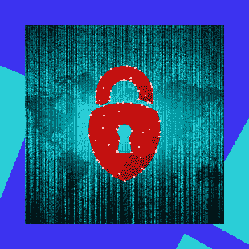
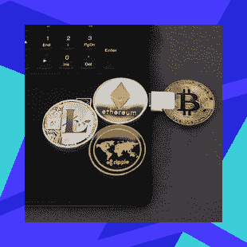
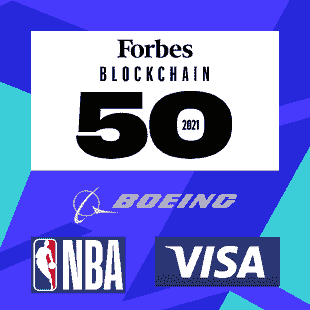
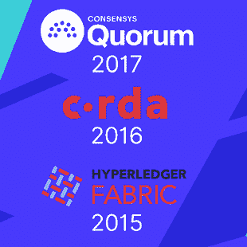

# 关于区块链的 7 个常见误区

> 原文：<https://blog.web3labs.com/7-common-myths-about-blockchain>

区块链是一种多功能技术，尽管它可能不是一种通用的解决方案，但绝大多数假设的缺点都源于对其工作方式的误解。最常见的错误是，人们倾向于将一些区块链解决方案面临的问题过于简单化，然后将其应用于每个区块链的 T2。同样，看穿这些神话的最好方法是通过自我教育。在这里，我们将列出困扰这一新兴技术的七个最常见的神话，并解释为什么它们不是真的。

## **1。区块链使用大量电力**

The most common myth comes from the fact that many blockchains use a Proof of Work (PoW) consensus algorithm, which is admittedly computationally heavy. However, PoW is far from the norm, and some existing blockchain platforms such as Ethereum are abandoning it in favor of less energy consumption offered by the Proof of Stake (PoS) consensus algorithm. 

此外，一些区块链使用大量电力的一个重要原因是因为它们是公开的。当涉及到面向企业的解决方案时，由于多种原因，它们往往是私有的和经过许可的，因此它们比公共解决方案使用的电力少得多。

## **2。区块链慢**

这是另一个源于公共网络的普遍神话。的确，你的比特币交易可能需要几个小时才能获得足够的确认，但你必须知道，比特币的区块链是公开的，因此每个人都可以访问——为了安全和透明，它的创造者决定速度不是它的主要特征。

另一方面，私有和许可的网络可以处理大得多的交易量。这部分是因为它们不是普遍可访问的，还因为它们在设计时更多地考虑了速度和可伸缩性。

## **3。大家可以看到我的数据**

许多公共网络都是如此；为了透明起见，这些网络上的所有交易都是可见的。然而，一些隐私硬币采用了一种称为零知识证明的概念:这是一种加密方法，通过这种方法，所有各方都确信一方拥有某些信息，而他们实际上并没有披露所述信息。

当涉及到私有和许可的区块链时，通常甚至不需要特殊的加密协议，这些平台可以被设计为只有那些具有特殊权限的人才可以查看和/或更改数据。

## **4。我的企业不能使用加密货币**

Luckily, it does not have to! While public networks *do* require tokens (not necessarily cryptocurrencies) to run, this does not have to be the case with private and permissioned networks. This is due to the fact that public networks are by definition required to allow participation to anyone as long as they have tokens; in other words, all the participants need to use the network are its native tokens. In the case of private blockchains, you can set the criteria for who can participate in the network, which completely eliminates the need for tokens or coins.

## **5。区块链还没准备好成为主流**

Many mainstream businesses would beg to differ. For example, esteemed business magazine Forbes has an annual [Blockchain 50](https://www.forbes.com/sites/michaeldelcastillo/2021/02/02/blockchain-50/?sh=72bab3c2231c) feature in which they list the companies that have already implemented the technology, but have a value or revenue of at least USD 1 billion as well. Here, you will see names such as A.P. Moller-Maersk, Boeing, CME Group, Daimler, IBM Corporation, National Basketball Association, Visa, and Walmart—each of them a giant in their own industry. The feature also lists the way in which blockchain is used in each business, as well as how far along this implementation currently is.

## **6。我所在的行业没有人使用它**

简而言之，这是非常不可能的——大多数行业已经以这样或那样的方式实施了区块链。一些例子包括:

*   科技:由于科技行业是区块链的诞生地，许多最大的科技公司都提供区块链平台，包括[亚马逊](https://aws.amazon.com/managed-blockchain/)、[微软](https://azure.microsoft.com/en-gb/services/blockchain-service/)和[甲骨文](https://www.oracle.com/uk/blockchain/)，这并不奇怪。
*   **银行业:**另一个非常适合区块链的行业，银行业也在很好地利用这项技术:2020 年 10 月，巴哈马群岛(CBOB) [的中央银行推出了世界上第一种中央银行数字货币(CBDC)](https://coingeek.com/bahamas-launches-sand-dollar-the-worlds-first-official-cbdc/) ，称为沙币，而其他一些中央银行正在研究甚至试行他们自己的 CBDC。
*   **保险业:**美国保险服务协会(AAIS)在区块链 Hyperledger 架构之上开发了 [OpenIDL 网络](https://www.hyperledger.org/learn/publications/openidl-case-study)，以简化整个保险业的数据收集和共享流程。
*   **供应链:**他们的金银完整性分类账生态系统的实时版本于 2020 年 10 月推出。
*   **医疗保健:**在新冠肺炎危机之后，[数字健康通行证](https://www.ibm.com/watson/health/resources/digital-health-pass-blockchain-explained/)是一个基于 IBM 区块链的解决方案，让人们可以跟踪他们的健康证书，并与任何需要它们的人分享——如雇主、客户、旅行社等。
*   **药房:** LedgerDomain 是一家企业级区块链解决方案提供商，致力于通过其基于 Hyperledger Fabric 的 [BRUINchain 生态系统](https://www.hyperledger.org/learn/publications/ledgerdomain-case-study)创新药品供应链，该生态系统被 FDA 选为其药品供应链安全法案(DSCSA)试点项目计划的一部分。
*   **政府:** Joisto 是一个电子存档和检索平台，现在希望通过他们的[基于 Hyperledger 结构的区块链平台](https://www.hyperledger.org/learn/publications/joitso-solution-brief)来满足 GDPR 的需求——通过使用区块链，他们确保存储的文档及其元数据是显而易见的。
*   **游戏:** [地平线](https://infura.io/customers/skyweaver)，一家区块链基础设施公司，创新游戏，正在使用以太坊的公共区块链为他们的 SkyWeaver 游戏作为他们卡的基础，这是以太坊 ERC-1155 代币。
*   **房地产:**[日本 NEXCHAIN 财团正在使用 ConsenSys Quorum 平台](https://www.ledgerinsights.com/japanese-consortium-blockchain-platform-real-estate-rental-nexchain/)为房屋租赁提供端到端解决方案。
*   **社会影响:** [Hala Systems](https://consensys.net/blockchain-use-cases/social-impact/hala-systems-case-study/) 是选择公共以太坊区块链的另一个解决方案:他们正在使用该技术改进他们现有的哨兵预警系统，该系统在叙利亚内战中用作空袭警报系统，并确保数据未被篡改。该公司及其技术已经拯救了无数平民的生命。

## **7。区块链缺乏成熟度**

案例研究的数量证明了事实并非如此——主要平台已经存在多年的事实也证明了这一点。例如，ConsenSys Quorum 最初是由 JP 摩根在 2017 年开发的，Hyperledger Fabric 自 2015 年末就已经存在，而 Corda 背后的 R3 财团成立于 2014 年，而区块链本身是在 2016 年推出的。

**结论**

区块链是一个已经建立的解决方案，由许多大公司实施，这意味着您不应该害怕考虑它在您自己的组织中的位置。随着对能耗、速度、数据可见性、令牌使用、主流使用和成熟度的担忧得到缓解，您可以通过观看我们的视频[了解更多关于区块链的特殊优势？](https://blog.web3labs.com/new-video-what-is-blockchain-great-at)

区块链还有其他阻碍你实施这项技术的缺点吗？你认为我们还应该报道哪些流言？请在下面给我们留言。要了解有关企业级区块链实施的更多信息，请注册参加我们即将举办的[成功部署原则](https://www.web3labs.com/principles-webinar)网络研讨会。