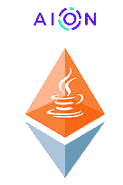
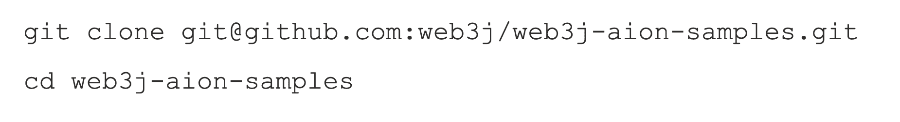
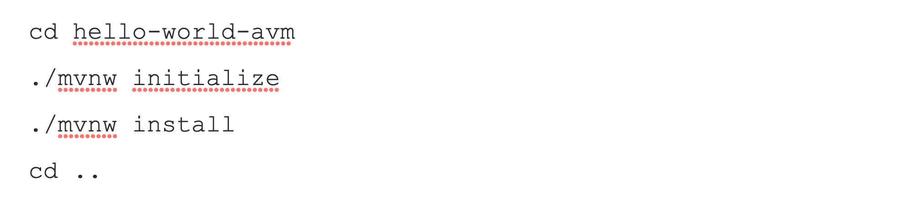

# 宣布 web3j — Aion 集成

> 原文：<https://blog.web3labs.com/web3development/announcing-web3j-aion-integration>



在与 [Aion network](https://aion.network/) 团队紧密合作后，Web3 Labs 自豪地宣布了 [web3j Aion](https://github.com/web3j/aion) 集成的可用性，以支持 2019 年 9 月的 [Aion 虚拟机](https://github.com/aionnetwork/AVM) (AVM)。

AVM 是一个符合 JVM 的区块链执行环境，它打开了整个 Java 生态系统，使您能够用 Java 编写智能合同。

在[Aion bounts&Grants 项目](https://aion.network/bounty/)下开发的 *web3j Aion* 项目现在是与区块链基础设施集成的互操作工具的 web3j 生态系统的一部分，并且**公开**在 [Maven Central](https://mvnrepository.com/artifact/org.web3j.aion) 和 [jCenter](https://bintray.com/web3j/maven/org.web3j.aion) 存储库中可用。

## web3j Aion 项目

和一群志同道合的工程师一起工作很棒。像 [Aion 团队](https://aion.network/team/)一样，我们是充满激情的技术专家，努力保持区块链技术的简单，并分享对 Java 和 JVM 在区块链的[未来的共同信念。](https://blog.aion.network/aion-virtual-machine-avm-why-java-and-the-jvm-240b78ad8a77)

当我们开始 [web3j-aion](https://github.com/web3j/web3j-aion) 项目时，我们的意图很明确。我们想让使用以太坊的 Java/JVM 开发人员以一种补充 Aion 堆栈的方式更容易地使用 Aion 区块链网络。此外，我们希望帮助开发者构建 dApps，同时促进开源。

[web3j-aion](https://github.com/web3j/web3j-aion) 项目增加了现有的 Aion Java 开发栈:一个 [Maven 插件](https://www.bloxbean.com/portfolio-item/aion4j-maven-plugin/)和 [IntelliJ Idea 插件](https://plugins.jetbrains.com/plugin/12047-aion4j-avm-integration)。通过与熟悉的 web3j API 集成，Aion 网络对于已经使用 web3j 与 Ethereum 一起工作的开发人员来说是可访问的。这为 Java 生态系统带来了类似 JavaScript [web3-aion](https://docs.aion.network/docs/aion-web3) 和 [Ethers.js](https://docs.aion.network/docs/ethersjs) 库的功能。

它还增加了可用于各种区块链客户和平台的 [web3j](http://web3j.io/) 集成的数量，其中已经包括奇偶校验、Geth 和[万神殿](https://github.com/PegaSysEng/pantheon)以及[法定人数](https://github.com/web3j/quorum)。

## 入门指南

为了快速启动和运行，我们创建了 web3j Aion [示例库](https://github.com/web3j/web3j-aion-samples)。它使您能够了解您的区块链代码和 Aion 智能合同的整个生命周期，从开发到部署。运行以下命令将使您能够通过几个步骤启动并运行 Java Aion 智能合同:

## 克隆样本存储库



## 编译 HelloWorld 契约

为了简化启动过程，我们在示例项目中包含了一个测试模块。这包含一个简单的 [Java 契约](https://docs.aion.network/docs/contract-fundamentals)，您可以修改并运行它，以便熟悉 web3j for Aion 开发环境:

> T2
> 
> ```
> public class HelloAvm {
>     private static String *myStr* = “Hello AVM”;    @Callable
>     public static void sayHello() {
>         Blockchain.*println*(“Hello Avm”);
>     }    @Callable
>     public static String greet(String name) {
>         return “Hello “ + name;
>     }    ...
> }
> ```

这个用 [*aion4j* Maven 原型](https://github.com/bloxbean/avm-archetype)生成的契约，通过打印一些日志、用给定的名称问候以及获取/设置作为契约状态存储的文本，演示了与契约的非常基本的交互。要编译它，从示例项目运行命令:



## 生成 HelloWorld 契约包装

一旦契约编译完成，创建的工件将会在 Maven 项目的目标文件夹中。将它们用作契约包装器生成任务的输入，可以使用以下命令运行该任务:


该任务运行 web3j Aion [命令行工具](https://github.com/web3j/web3j-aion/tree/master/codegen)来生成 [web3j 契约包装器](https://docs.web3j.io/smart_contracts.html#deploying-and-interacting-with-smart-contracts)。您可以使用它来部署智能合约并与之交互:

```
// Create an Aion instance with a node URL
Aion aion = Aion.*build*(new HttpService("..."));

// Create a manager for local transaction signing with a private key
TransactionManager manager = new AionTransactionManager(
    aion, new Ed25519KeyPair("..."), VirtualMachine.*AVM*
);

// Deploy the HelloAvm contract
HelloAvm contract = HelloAvm.deploy(
    aion, manager, AionGasProvider.INSTANCE
).send();

// Call greet and receive "Hello John"
String result = contract.call_greet("John").send();
```

有关在 Aion 网络上使用这个契约包装器运行端到端测试的更多细节，请查看[项目文档](https://github.com/web3j/web3j-aion-samples)和 [web3j Aion 教程](https://docs.aion.network/docs/tutorials-web3j)。也请查看官方的[永恒之塔博客帖子](https://medium.com/@aion_network/web3j-is-now-live-on-aion-network-7180bd393463)上的项目公告。

### 下一步是什么？

我们对 web3j 中对 Aion 的支持感到非常兴奋，并渴望听到来自社区的反馈。如果您对项目有任何建议，请创建一个[新问题](https://github.com/web3j/aion/issues)，或者最好提交一个拉动请求！。我们很乐意将改进和新功能集成到库中。