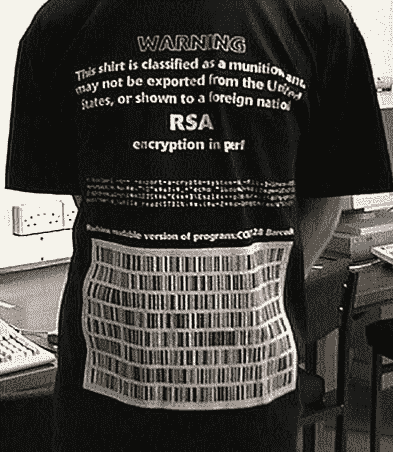

# 批发 DeFi

> 原文：<https://blog.web3labs.com/wholesale-defi>

TradFi 和 DeFi 之间存在明显的脱节。TradFi 受监管，DeFi 不受监管。在这两个行业之间存在着巨大的不确定性，初创公司、企业和 web3 黑客试图找到在这两者之间架起桥梁的方法。

对于 web3 的支持者来说，未来是确定的——它是“**链上的**”，所有的金融实体都进化成位于区块链之上的协议。对其对手来说，web3 是一个庞氏骗局，一个骗子和江湖骗子居住的世界，他们声称正在建设未来，但事实上，他们只关心他们的加密令牌的价值。**在这种背景下，这样的技术怎么会受到重视呢？**

与此相反，你将面临一个 25 万亿美元产业的未来，这个产业正试图弄清楚应该如何看待区块链技术。

对于 web3 技术专家来说，答案往往很简单，通过在区块链上表示金融资产，您可以消除当前存在于世界各地银行和其他大型金融机构的各种数据仓库中的所有重复数据。任何在金融服务业呆过的人都知道，答案要比这复杂得多。金融是一个受到高度监管的行业，存在相当多的欺诈、投机和市场操纵，这与 DeFi now 没有什么不同。

监管的发展是为了试图保护被利用的消费者和企业，同时确保公司遵守运营惯例，使他们更难有意或无意地实施欺诈，或遭受安全漏洞和其他可能伤害他们和他们的客户的活动。

它远非完美——我们仍然看到骗子为了他们的存款而瞄准弱势群体，对冲基金变得贪婪并过度扩张自己(长期资本管理公司，3AC)，从事欺诈活动的公司(Wirecard，安然)和政府救助。

在 web3 中，我们看到监管机构正在使用高压手段来针对那些违反法律的个人和公司(见[维吉尔·格里芬](https://en.wikipedia.org/wiki/Virgil_Griffith)和[阿列克谢·佩尔采夫](https://www.coindesk.com/policy/2022/08/24/alleged-tornado-developer-pertsev-must-stay-in-jail-dutch-judge-rules/))。这与早期的互联网有相似之处，当时美国严格限制[出口加密技术](https://en.wikipedia.org/wiki/Export_of_cryptography_from_the_United_States)

从美国出口这种 t 恤或者向外国人展示这种 t 恤曾经是违法的

随着时间的推移，监管机构往往会恢复理智，但监管永远在追赶技术和行业趋势——监管更多的是对事件做出反应，而不是主动出击。这种监管现实对 TradFi 拥抱 web3 技术的速度有着重大影响。

Crypto 提供了一种通过加密货币或 stablecoins 在世界任何地方发送资金的机制，无需中介。DeFi 为投资者提供了全新的机会，让他们可以接触到 web3 之前根本无法获得的产品，例如在分散式交易所创建和做市的能力。

在这方面，crypto 和 DeFi 的全球影响力只需要一个互联网连接和技术知识， **crypto 和 DeFi 创造了一个民主化的金融系统**。多亏了区块链提供的信任层，这些数字资产和 DeFi 协议才得以建立。在过去几年中，crypto 和 DeFi 生态系统中可能出现的物质收益创造了对支持这些 web3 资产和协议的产品和服务的滚雪球式需求。交易所、加密贷款机构和加密应用程序如雨后春笋般涌现，以满足消费者和机构不断增长的需求。

实际上，这些企业专注于将数字资产作为一种新型资产类别纳入金融生态系统，而不是拥抱他们全心全意使用的底层 rails。它确实提供了一个基于 web3 的未来可能会是什么样子的一瞥，但监管将需要跟上。目前，金融市场生态系统的很大一部分与消费者隔离开来。获得产品和服务是由银行、股票经纪人和支付公司等受监管的中介机构授予的。然后，这些中介机构通过私人批发金融市场(其中一些是私人金融网络，如由 Swift 或 Mastercard 运营的支付网络)或通过 DTCC、证券交易所和清算所等金融市场基础设施公司进行互动。

鉴于全球金融服务的广度，这些批发市场在参与者数量和它们在全球促成的交易规模方面都是巨大的。这种规模带来了大量的监管，随着时间的推移，也带来了大量的复杂性和低效率。在这些市场中，区块链技术有很大的机会影响金融服务。然而，它不太可能是通过 DeFi 使用的同一剧本。监管约束带来了关于哪些公司可以成为这些批发金融网络成员的严格要求。基础设施提供商必须克服巨大的监管障碍，才能在这些生态系统中成为服务提供商。

区块链技术在这里经常被接受的方式是通过私人许可的区块链，它可以被控制并遵守监管准则。没有强大的身份、访问和隐私保证的公共区块链网络将在许多情况下陷入困境，因为这种网络关系重大。这并不是说公共区块链将无法受益于这样的环境，消费者跨境支付已经是被 web3 严重破坏的金融生态系统的一部分。然而，就受监管行业而言，最终将由监管机构决定哪些活动可以参与，哪些活动不可以参与。

没有身份、访问和隐私问题的解决方案，这是不可能发生的。因此，我们有可能在 TradFi for web3 中看到与万维网相似的情况。这就是消费者是 web3 生态系统的主要受益者。网络繁荣刺激了许多金融机构使用诸如 HTML 和网络浏览器之类的网络技术为他们的客户创建在线服务，但在幕后，他们依赖于相同的旧基础设施为他们的客户服务，正如他们多年来所做的那样。在批发市场，严格控制的、用自己的专有协议构建的私有网络被创建来满足他们的需求。它们建立在互联网的 TCP/IP 协议栈上，但不需要像网络一样面向消费者的技术。

因此，我们已经看到很多这样的实体创建了私人许可的区块链来利用 web3 技术，因为他们习惯于在私有网络中工作。这些网络更有可能吸引监管者，因为它们是封闭的，受到严格控制，但完全独立于公共网络。在未来，批发市场以类似于其当前形式的方式存在是可行的，但区块链技术为它们提供了更高的效率。这部分是因为公共区块链没有支持其许多用例所需的许可、隐私和可扩展性，还因为公共网络是不受监管的实体。

这意味着在不久的将来，在批发金融市场中，许多私人许可的网络可能会发展壮大，对公共网络的探索将会继续，但并不适合所有的用例。也许 TradFi 和 DeFi/web3 之间的融合会比我们在 web1/2 和批发市场上看到的更大。但如果没有监管支持，这将是一场艰苦的战斗。