# Sirato 走向移动

> 原文：<https://blog.web3labs.com/web3development/block-explorer-epirus-goes-mobile>

虽然我们的 Sirato 区块链法定人数和以太坊浏览器主要是为了在台式机或笔记本电脑上运行，我们一直希望确保它也能在移动设备上提供良好的用户体验。

我们不久前发布了移动支持，但我们想做一个专门的帖子，带你了解它提供的所有伟大功能。

*How do you ensure the same awesome experience on mobile?*

移动体验提供了浏览器的所有核心功能，如令牌、合同、地址、交易和阻止视图，以及所有过滤和搜索功能。

## 航行

通过屏幕底部的菜单进行导航。

## 契约

与桌面版本一样，您的入口点是 contracts 视图。

点击合同将带您进入合同详情。

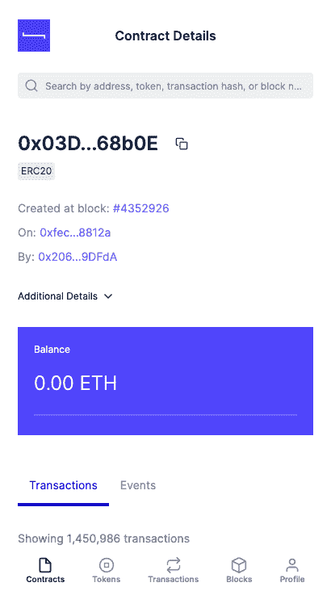

## 过滤和排序

您还可以对所有列表视图进行排序和筛选。

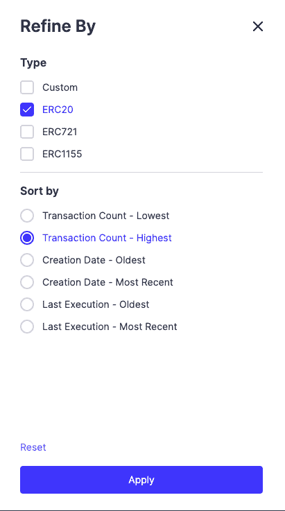

例如，您可以通过最活跃的 ERC20 合同进行排序。

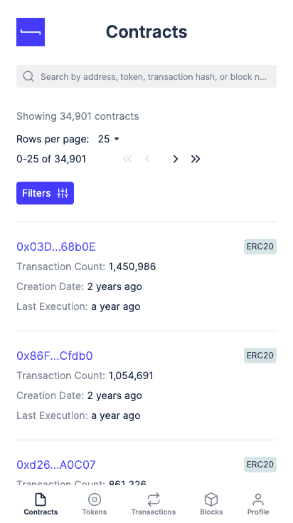

## 代币

导航到“令牌”页面，我们会看到所有令牌都已列出。

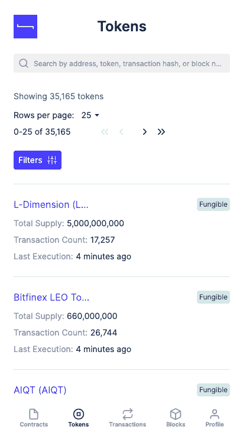

在这里我们可以查看单个令牌的详细信息。

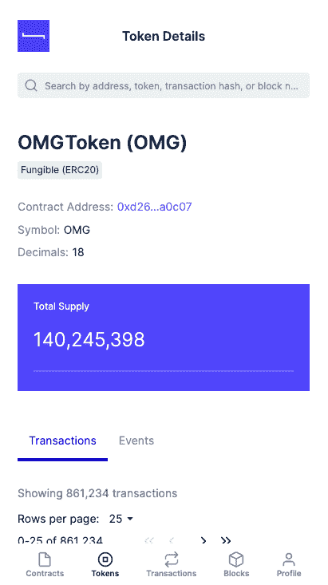

## 帐目

当我们浏览到与以太坊钱包相关联的账户时，我们还可以查看账户余额，即不是智能合约地址。

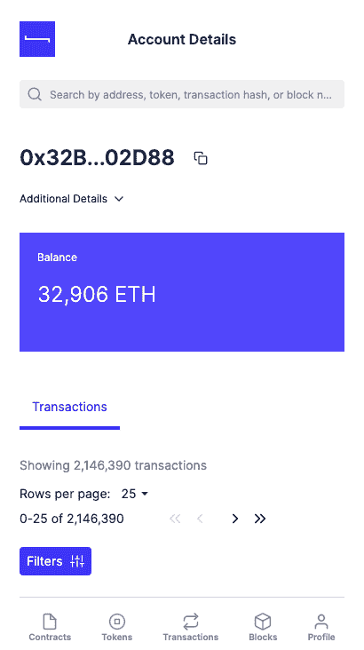

## 处理

事务视图列出了所有事务。

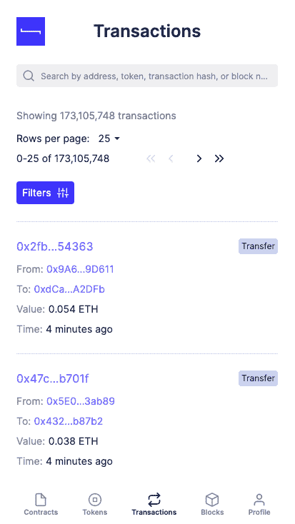

点击交易，提供交易详情。

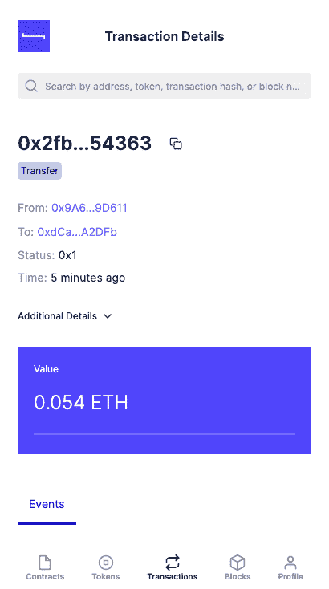

## 阻碍

同样，blocks 视图列出了所有块。

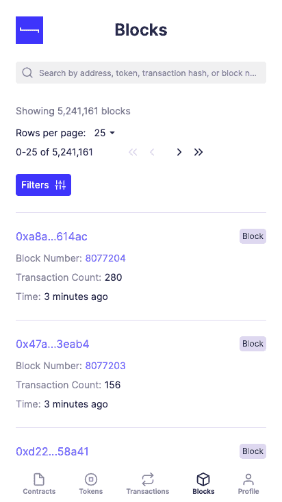

同样，单击一个块会提供该块的相关事务的详细信息。

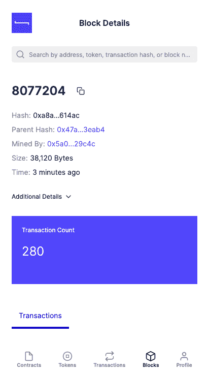

## 轮廓

最后，Profile 视图允许您查看网络的同步状态，并浏览合同注册表。

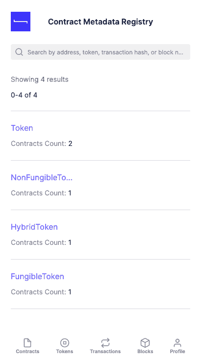

在接下来的几周里，我们将带您了解 Sirato 的其他一些优秀功能。与此同时，请[在我们的电子邮件列表中注册](https://blk.us17.list-manage.com/subscribe/post?u=412696652858d5fc58dd705c9&id=b629184709)以首先了解伟大的新功能，并在 Azure 上查看[Sirato](https://web3labs.com/azure-offer)！