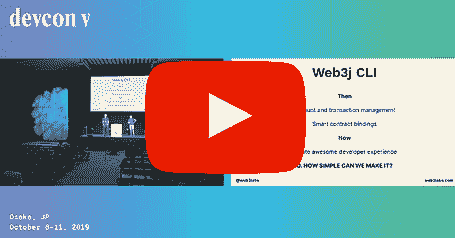

# Web3j 以太坊基金会资助更新

> 原文：<https://blog.web3labs.com/web3development/web3j-ethereum-foundation-grant-update>

回到敌无双五世，我们[高兴地宣布【Web3 实验室获得了以太坊基金会对 Web3j 的资助。](https://www.youtube.com/watch?v=Igc1WlMeEoE)

Web3j 是 Java 虚拟机(JVM)上领先的以太坊集成库。它于 2016 年 9 月在敌无双 2 上首次发布，自发布以来已被下载超过 200 万次！它也被 Android 社区广泛使用，被集成到三星的区块链 SDK 和 Opera 浏览器中。

## 我们取得的成就

以太坊基金会的支持对 Web3j 来说是恰逢其时。它使我们能够扩大 Web3j 团队，使我们能够进一步改善 Web3j 的开发人员体验。自 10 月份获得资助以来，我们已经成功实现了几个里程碑，您可以# buidl:

*   使用 [Epirus CLI](http://github.com/epirus-io/epirus-cli) 在单个命令中生成一个新的准备就绪的区块链应用程序项目——包括应用程序代码、钱包、通过集成 EVM 进行的单元测试，所有这些都是从源 Solidity 契约自动生成的
*   使用 [Web3j Unit](https://github.com/web3j/unit) 通过内存中的 EVM 或 dockered Geth/Besu/Parity 节点测试您的智能合约
*   使用 [Web3j EVM](https://github.com/web3j/unit) 从 JVM 内部调试和测试您的智能合约
*   使用 Web3j Audit 审计您的智能合同

## 未来的工作

我们正在考虑使用补助资金的其他领域包括:

*   智能合约的 API 生成
*   Vyper 支持
*   增强 Eth2 开发人员体验的方法
*   创建更多以开发者为中心的内容，以帮助推动更广泛的 JVM 社区(即区块链/DLT 的新用户)的采用。

随着我们最近宣布的 [Web3j SDK 和](https://www.web3labs.com/web3j)在 ethereum.org[与 JVM 合作的精彩内容，](https://ethereum.org/java)我们感到有一个极好的机会将以太坊技术扩展到更多的开发者。

最后，我们还要感谢 12 个月前提供 Web3j 资助的 [ECF](https://ecf.network/) ，以及继续资助项目相关事宜的 [Gitcoin](https://gitcoin.co/explorer?idx_status=open&applicants=ALL&keywords=web3j&order_by=-web3_created) 。

如果你想看看所有的大惊小怪是怎么回事，前往我们的[入门页面](https://www.web3labs.com/web3j)获取#building on Web3！