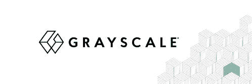
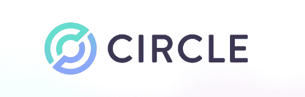

# 区块链的下一步是什么:企业定义

> 原文：<https://blog.web3labs.com/whats-next-for-blockchain-enterprise-defi>

分散金融(DeFi)部门的持续增长使其成为吸引全球机构参与者的场所。他们中的许多人已经开始积累大量的比特币和以太币，以应对通货膨胀的担忧，并作为产生有形收入的新方式。

最近的一项研究揭示了这种兴趣有多大。具体而言，绝大多数最大的对冲基金高管认为，到 2026 年，他们的资产中至少有 7.2%将是加密货币。这相当于整个行业约 3120 亿美元。这种日益增长的兴趣导致了一个新想法的出现——企业定义。企业 DeFi 是一个概念，指的是部署分散金融(DeFi)技术的主要全球机构，以推进其服务、产品和运营，以及探索其他机会。

多亏了创造这些技术的公司，机构投资者可以无缝地进入在区块链驱动的金融基础设施上运行的新贷款市场，这是他们过去不容易做到的事情。通过这种方式，他们可以创造新的收入来源，这些收入来源通常比他们使用传统方式获得的收入要多得多。最重要的是，他们可以在这个过程中省去中间人，以及任何不必要的费用和官僚作风。

让我们仔细看看那些创造产品的著名平台，它们成功地将这两个不同的世界拉近了距离。

## **Aave Arc 平台发布**

为了让企业界更容易实施这项技术，DeFi 流动性平台 [Aave](https://aave.com/) 宣布推出面向机构投资者的 Aave Arc 协议。Aave Arc 的目的是利用私人资金池为机构投资者提供直接进入分散市场的机会，否则他们将因严格的监管要求而无法进入这些市场。

这些资金池将独立于 Aave 目前的流动性资金池，只对通过“了解你的客户”( KYC)程序的参与者开放。这里指的是借贷双方。

像 Aave 这样的 DeFi 借贷平台使用智能合约，允许用户在没有中间人干预的情况下借出、借出加密资产并赚取利息。Aave 的大部分业务都在以太坊区块链上运行，尽管该公司最近成功地部署了与 Polygon 网络的集成。Aave 被认为是同类公司中最大的公司之一，因为它通过其平台获得了近 270 亿美元的资产。

## **灰度即将推出的 DeFi 基金**

在 DeFi 平台中，Aave 并不是唯一一个将自己的视野扩展到企业界的平台。由于企业家对 DeFi 世界越来越感兴趣，数字资产管理公司[gray](https://grayscale.com/)宣布了其针对机构投资者的新投资产品。其首席执行官 Michael Sonnenshein 在美国消费者新闻与商业频道的 Squawk Box 上详细介绍了该公司的计划，包括 DeFi 基金和指数。根据 Sonnenshein 的说法，该基金将为其机构客户提供一系列行业领先的 DeFi 协议，如 Aave 和 Uniswap。它将通过跟踪 CoinDesk DeFi 指数的市值加权投资组合来实现这一目标。

Grayscale 通过其产品系列，通过机构的经纪账户提供对数字资产的市场洞察和投资敞口。截至 2021 年 7 月，gray Investments 管理的资产超过 280 亿美元。这是该公司的第十五个投资产品和第二个多元化基金产品。

## **Circle 的新定义 API**

随着 DeFi 市场趋于平缓，用户现在可以在不同的 DeFi 生态系统中种植作物。为了向企业提供对领先的 DeFi 协议的访问，并允许他们轻松地跨不同的生态系统传输他们的数字资产，一些协议正在引入所谓的桥。

其中之一是 [Circle](https://www.circle.com/en/) ，这是一家专注于创建技术和基础设施的公司，这些技术和基础设施可以弥合企业和 DeFi 之间的差距，同时确保整个过程的易用性和更好的访问。

本着这一目标，Circle 推出了其新的 DeFi 产品，该产品将允许企业和机构轻松、无风险地管理、保护直接网络参与者并与之交互，这是他们以前无法做到的。最重要的是，它将消除运行加密金融基础设施的高成本和监管复杂性。通过结合 USDC(美元硬币)、Circle Accounts、其新的 Circle Yield 产品和这一新的 DeFi 产品，Circle 现在可以为机构投资者提供一整套加密货币本地支付和资金基础设施。

## **伊尔德利的阿尔格兰德-以太坊桥**

另一个连接两个世界的伟大例子是 [Yieldly](https://yieldly.finance/) 和它的 algrand-Ethereum 桥，它允许用户在它的底层 algrand 区块链和 ether eum 之间无缝交换价值。YLDY-ALGO 池允许用户获得超过 100%的资产年化利率(APR)。

这与传统借贷截然不同，在传统借贷中，这一比例从未超过 1%-5%。此外，通过产量农业的复利回报可能有助于锁定可能在 500%至 1000%之间的 APR。

Yieldly 建立在阿尔格兰德区块链之上，其使命是创建下一代 DeFi 生态系统。该公司使用这种特殊区块链的理由包括更快的交易、更低的费用和更高的安全性——所有这些都是 Yieldly 使命的一部分。

### **遗言**

随着时间的推移，越来越明显的是，DeFi 部门不仅会留在这里，而且将会更好地改变投资格局。投资者和企业家意识到了这一点，在 DeFi 平台工作的人们也是如此。这就是为什么整个行业的专家都在夜以继日地工作，以带来最好的解决方案，成功而轻松地弥合差距，连接这两个看似不兼容的世界。

你认为未来企业定义的概念会是什么？你有任何问题，意见，或者你可能已经注意到我们错过了什么？我们希望收到您的来信，请务必在评论中告诉我们！我们也欢迎您访问我们的[博客](https://blog.web3labs.com/)或收听我们的资讯性和娱乐性[区块链创新者播客](https://podcast.web3labs.com/)。在那里，你可以更多地了解区块链的革命世界及其不断的创新。