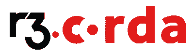

# 区块链神话:主流采用

> 原文：<https://blog.web3labs.com/blockchain-myths-mainstream-adoption>

区块链“成为主流”已经成为业界谈论多年的话题。但是，鉴于它已经在许多世界上最大的公司留下了显著的足迹，更好的问题是，“谁还没有采用它？”

这方面的一个最好的例子是年度福布斯[区块链 50](https://www.forbes.com/sites/michaeldelcastillo/2021/02/02/blockchain-50/?sh=72bab3c2231c) 名单，其中他们展示了收入超过 10 亿美元的公司，这些公司已经实施了这项新生技术，以及实施进展如何。文章本身指出，区块链已经成为主流，21 个新人进入名单，证明高调实施区块链的数量正在稳步增长。

大多数上市公司使用不止一个区块链平台，因为许多公司经营多个项目。一些交易加密货币的银行——尤其是那些——只使用托管这些货币的公共区块链。由于我们认为 Hyperledger Fabric、ConsenSys Quorum 和 R3 Corda 是最佳的企业级区块链提供商，我们将逐一介绍目前使用它们的不同公司。

## ****

## **总账结构**

最初由 IBM 和 Digital Asset 贡献的企业级区块链是迄今为止区块链 50 强中最受欢迎的，共有 24 家企业使用:

*   **穆勒-马士基集团**通过区块链处理供应链信息和海事保险。
*   蚂蚁集团在其专有的区块链平台 AntChain 上有超过 50 个处于不同阶段的区块链应用程序。
*   百度有 20 多种区块链解决方案——其中一种是处理版权纠纷的方式。
*   **必和必拓**将该技术主要用于供应链信息。
*   波音公司有一个基于区块链的无人机空中交通管制系统。
*   法国连锁超市家乐福在区块链追踪几种食品，让顾客检查他们产品的来源。
*   **中国建设银行**利用区块链帮助借款人获得贷款，同时也识别有风险的借款人。
*   **CONA 服务公司**打算将不同可口可乐装瓶厂之间的所有订单和货物转移到区块链。
*   戴姆勒正在将区块链应用于几个领域，包括筹资。
*   存托信托&清算公司(DTCC) 已经将 11 万亿美元的信用衍生品转移到区块链。
*   霍尼韦尔在区块链保存了 200 万份航空质量文件，以便用户更容易获取，同时在区块链的市场上出售二手航空零件。
*   **汇丰银行**利用区块链改善其全球分支机构之间的流动。
*   IBM 公司有一个数字健康通行证应用程序，允许人们，如活动组织者，在让他们进入之前检查个人的新冠肺炎结果。
*   **工行**:该行共有 30 款区块链应用，利用这项技术让客户追踪存储在上面的数据。
*   **ING Group** 帮助多个不同的金融机构检查加密资产是否符合反洗钱标准。
*   Nornickel 目前正处于由 Fabric 提供支持的工业资产令牌化平台的测试阶段。
*   **北方信托**投资了加密初创公司 Zodia 保管公司。
*   **诺华公司**使用区块链跟踪不正确或过期的药品信息，同时跟踪黑市或假药。
*   Oracle 有一个总部位于区块链的海运联盟，由 300 名客户组成。
*   在区块链的帮助下，Sappi 公司不仅确保了他们生产的纸浆的可持续性，还确保了后来使用这些材料生产的所有产品的可持续性。
*   **Swisscom** 共有 11 种不同的区块链应用，大多与加密货币有关。
*   Tech Mahindra 有一个位于区块链的应用程序，可以帮助手机用户躲避垃圾电话。
*   **Telefonica** 使用区块链跟踪数百万个家庭设备。
*   **沃尔玛的**该技术的主要用例是跟踪和检测食品安全问题。

## ****

## **议会法定人数**

基于以太坊的 ConsenSys Quorum 也受到希望使用区块链的大型企业的欢迎:

*   **蚁族:**见上图
*   嘉吉公司利用这项技术追踪不同产品在世界各地的动向。
*   **汇丰:**见上文
*   **ING 组**:见上图
*   Quorum 的发源地摩根大通提供了一个加速银行间交易的区块链网络，目前已有 425 家银行注册。
*   LVMH 正在追踪奢侈品牌的产品，以打击假冒产品。
*   微软与区块链一起管理版税和内容权利。
*   **诺华**:见上文
*   **国营农场**通过技术处理代位权。【T2
    

## **R3 Corda**

虽然没有前两家那么受欢迎，但至少在这 50 强公司中，Corda 仍然在区块链的主要平台上留下了自己的印记。由于使用 Corda 的每家公司都已经在使用前两个平台中的一个或两个，我们省略了对相关用例的详细描述。这些公司是:

*   **戴姆勒**
*   **存管信托&结算公司(DTCC)**
*   **汇丰银行**
*   **ING 组**
*   **诺华**
*   **瑞士电信**

### **结论**

区块链是一项被模糊理解的技术，似乎只为比特币提供动力——对许多人来说也是一个灰色地带——的日子已经一去不复返了，取而代之的是该技术在几个主要行业的蓬勃发展。随着这些公司中的许多公司带头研究尽可能多的不同用例(如我们所见，有时超过 50 个项目)，区块链已经被广泛认为是许多项目的最佳选择。

您是否知道其他不在列表中但应该包括在内的著名的区块链实现？请在评论中告诉我们！有兴趣了解区块链是否能解决您企业的痛点吗？观看我们在[上的视频，区块链最擅长什么？](https://blog.web3labs.com/new-video-what-is-blockchain-great-at)或者报名参加我们即将举办的[成功部署原则](https://www.web3labs.com/principles-webinar)网络研讨会，它将覆盖更多领域，并尝试回答您的所有问题。