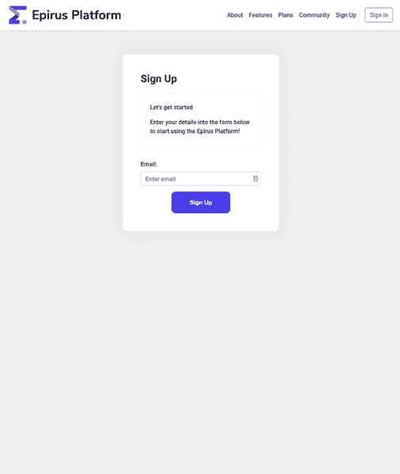
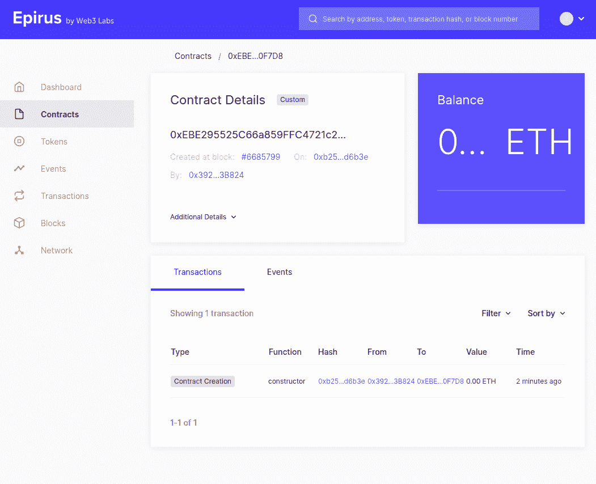

# 将您的 Java 应用程序连接到以太坊区块链

> 原文：<https://blog.web3labs.com/web3development/deploying-your-first-smart-contract-with-java>

作为一名 Java 开发人员，构建一个与以太坊智能合约交互的系统可能是一件痛苦的事情。您需要克服许多挑战，更不用说了解什么是区块链及其工作原理了。智能合约通常是用其他语言编写的这一事实也于事无补。

如果手边有工具可以简化流程，那不是很好吗？这就是 Epirus CLI 的用武之地，它是一个 CLI 工具，使用 Web3j，以太坊的 Java 库。

## 使用智能合同的挑战

以太坊智能合约一般都是用 Solidity 写的，虽然也有几个比较新的语言像 Vyper 和 Bamboo，还有 Flint。无论何种语言，所有智能合约都需要遵守 EVM(以太坊虚拟机)的规范，该规范在概念上类似于 JVM，但具有许多不同的属性。例如，在 EVM 中，数值类型表示为 256 位数，而 JVM long(最大的原始数值类型)只有 64 位长。

要与 EVM 中运行的智能合约进行交互，需要知道如何与以太坊区块链进行交互。这需要将事务发送到实现以太坊规范的服务。

有三种类型的事务可以调用:

*   乙醚的转移。
*   智能合同的部署。
*   调用智能合同功能。

还有支付这些交易的问题。由于区块链是去中心化的，人们需要提供一个经济激励来使他们的交易被区块链接受。Web3j 提供了一些抽象，使得与以太坊区块链集成来处理智能合约变得轻而易举。

## Web3j 如何提供帮助


上图显示了 Web3j 在幕后所做工作的高级概述。本质上，可以使用 Web3j API 构建一个事务，然后在幕后，Web3j 将签署该事务并向以太坊客户端发出请求。一旦交易进入一个块，Web3j 将返回一个交易收据，它可以用来检查交易的结果。例如，当发送合同部署事务时，事务收据将包含合同部署的地址。

## 部署智能合同的 3 个步骤

所以，有人把一堆智能合约扔进了你的 VCS，而你被赋予了在区块链部署它们的任务。使用一些 Web3j 工具，可以生成使用 Java 智能契约的脚手架。

**步骤 1** 通过一个简单的命令安装和使用 Epirus CLI(链接):


```java
curl -L https://get.epirus.io | sh
```

我们将使用 Epirus CLI 生成一个 Java Gradle 项目，该项目将内置一些漂亮的依赖项:

```java
epirus new
```

此命令将引导您完成一系列交互式步骤来设置您的项目。或者，您可以通过命令行传递选项，如下所示:

```java
epirus new -n <project name> -p <package name> -s <path to solidity sources> [-o <path>] -t
```

您需要为项目、包结构和实体源的路径提供一个名称。Solidity sources 是一个包含 Solidity smart contracts 的文件夹。`-o '选项将在给定的路径下创建项目，默认情况下，它将是您运行命令的目录。`-t '选项将为您的智能合约生成单元测试。

项目生成后，可以在您选择的 IDE 中打开它。


**第二步**解析你的以太坊客户端，为你的钱包注资。有多种方法可以做到这一点。您可以运行自己的以太坊客户端并连接到任何网络，您可以连接到以太坊客户端云提供商，如 Infura -它代表您管理以太坊客户端，或者出于开发目的，您可以使用模拟区块链的嵌入式以太坊客户端。幸运的是，生成的项目将依赖于 [web3j-unit](https://github.com/web3j/web3j-unit) ，它是一个 JUnit5 扩展，将在进程中或 Docker 容器中注入一个以太坊客户端实例。您可以查看生成的测试。

但是，在本例中，我们将使用 Epirus 区块链基础设施将合同部署到一个实时网络中。继续创建一个[免费账户](https://docs.epirus.io/getting_started/#free)。之后，让我们创建一个新项目并获取 Rinkeby 网络的 URL。Rinkeby 网络是以太坊的测试网络，是开始部署合同的好地方。



**第 3 步**运行应用程序。Epirus CLI 附带了一个漂亮的项目部署器。前往生成项目并运行的目录:

> 伊庇鲁斯部署林克比

该命令将为您处理一切，从为您的 testnet 钱包提供资金到向以太坊区块链发送交易。该合同将部署在 Rinkeby 测试网上。


事务之间会有一些延迟，因为我们要将应用程序部署到一个实时网络中。一旦应用程序运行完毕，你就可以前往 [www.rinkeby.etherscan.io](http://www.rinkeby.etherscan.io/) 查看公共区块链上的一些事务散列。



请继续关注这个迷你系列的下一篇文章，我们将讨论如何管理已经部署在区块链上的智能合同并与之交互。