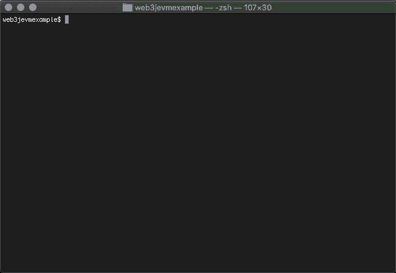

# 调试 Solidity 智能合约

> 原文：<https://blog.web3labs.com/web3development/debugging-solidity-smart-contracts>

在我的[上一篇](https://blog.web3labs.com/how-to-test-ethereum-smart-contracts)中，我们查看了 [web3j-unit](https://github.com/web3j/web3j-unit) 和 [web3j-evm](https://github.com/web3j/web3j-evm) 库。这些工具可以帮助你使用 Web3j 和 Java 测试你的 Solidity 智能合约。在这篇博客文章中，我们将花更多的时间来看看您在 web3j-evm 库中找到的控制台调试器。

控制台调试器，也称为 ConsoleDebugTracer，允许您在部署智能合约并与之交互时，逐步了解正在发生的事情的细节。虽然最初我们只支持向您展示底层操作码和堆栈，但我们一直在努力扩展这一功能，以包括 Solidity 源代码。从 4.5.12 版开始，这一功能已普遍提供。



*Running the EVM example demo, with Solidity breakpoints*

上面的演示展示了我们调试器的许多特性。以下是您如何从终端本地完成此操作:

```
$ git clone https://github.com/web3j/web3j-evmexample.git
$ cd web3j-evmexample
$ ./gradlew --console=plain clean build run
```

运行 gradlew 时，您正在启动主[演示类](https://github.com/web3j/web3j-evmexample/blob/master/src/main/java/org/web3j/web3jevmexample/Demo.java)。因为项目被配置成使用我们的 [solidity gradle 插件](https://github.com/web3j/web3j-gradle-plugin)，它还负责编译所有的 [Solidity 契约](https://github.com/web3j/web3j-evmexample/tree/master/src/main/solidity)。随着演示开始，您将进入控制台调试器，我们将设置一个断点:

```
: break Greeter.sol 13

```

添加后，我们可以执行下一个命令来跳过前两个事务。

```
: next
: next
```

此时，您将看到“迎宾员已部署，即将开始迎宾..”在控制台上。我们现在进入将获取问候的事务。给我们这个问候的函数恰好位于 [Greeter.sol](https://github.com/web3j/web3j-evmexample/blob/master/src/main/solidity/Greeter.sol) 契约中的第 13 行附近，我们之前在这里添加了断点。现在做下一步会把我们带到那里。

```
: next
```

此时，您会注意到许多低级操作码和一些堆栈细节。我们用 hide 命令隐藏这些。

```
: hide opcodes
: hide stack
```

我们总是可以使用 show 命令将它们恢复。也可以使用其他选项，如使用 help 命令时所示。我们也有兴趣获得您对调试器的反馈，哪些有效，哪些缺失，并鼓励您[加入讨论](https://community.web3labs.com/)。