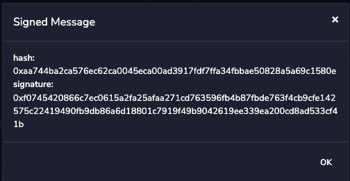
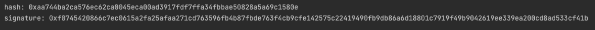

# 如何用 Web3j 签署消息

> 原文：<https://blog.web3labs.com/web3development/how-to-sign-messages-with-web3j>

自 2017 年以来，使用 Web3j 签署链外消息的能力已经成为可能。随着时间的推移，已经进行了改进，不仅支持基本的字符串消息，还支持一些更复杂的结构化消息。在本帖中，我们将重点讨论基本非结构化数据的签名。

要实现以太坊注销链:

> eth _ sign(ke ccak 256(" \ x19 以太坊签名消息:\n" + len(message) + message)))

以下是要遵循的步骤:

1.  生成带有以太网专用前缀的消息；

2.  用 keccak256 散列步骤 1 中的消息；

3.  使用前一步骤获得的结果并应用 ECSDA(椭圆曲线数字签名算法)生成包含 r、s 和 v 元素的最终签名。

在 Web3j 中，所有的步骤都已经实现，只需从 crypto 模块调用静态方法 Sign # signPrefixedMessage 就可以直接完成签名。

实际上，假设我们想用某个帐户凭证签署字符串“Hello”。所以我们有:

> string messageToBeSigned = " Hello "；

> //帐户的私钥
> 
> //0x 5b 38 da 6a 701 c 568545 DCF CB 03 fcb 875 f 56 bedd C4 from
> 
> //[https://remix.ethereum.org/](https://remix.ethereum.org/)JavaScript 虚拟机(伦敦)。选择此特定//帐户是为了验证后者。
> 
> string private account key = " 503 f 38 a9 c 967 ed 597 e 47 Fe 25643985 f 032 b 072 db 8075426 a 92110 f 82 df 48 dfcb "

第一件事应该是创建凭证对象。这表示保存公钥和私钥以及地址的 account 对象。

credentials credentials = credentials . create(privateAccountKey)；

由于必须对消息应用大量散列和过程才能对其进行签名，我们将把它转换为字节:

> byte[]message bytes = message . getbytes(standard charsets。UTF _ 8)；

现在，我们可以简单地调用 Sign # signPrefixedMessage 来签名我们的消息:

> 签名。SignatureData signature = sign . sigprefixed message(message bytes，credentials . geteckeypair())；

结果将由一个 SignatureData 对象组成，该对象包含作为字节数组的 r、s 和 v 元素。为了以更易读的方式显示它们，重新组合以下代码片段:

> 字节[]重选=新字节[65]；
> 
> system . array copy(signature . getr()，0，retval，0，32)；
> 
> system . array copy(signature . gets()，0，retval，32，32)；
> 
> system . array copy(signature . getv()，0，retval，64，1)；

> system . out . println(numeric . tohexstring(retval))；

**注意，在 sign.java 中，有多种符号方法可能会引起混淆**。在所有这些中，只有 signPrefixedMessage 创建特定于以太网的签名，因为它在散列之前附加了特定的前缀。

正确的前缀哈希在 Sign#getEthereumMessageHash 中计算，它通过调用 Sign#getEthereumMessagePrefix 追加前缀。当然，可以使用任何 sign available 入口方法，但是如果前缀没有正确放置，结果将不会是类似于 web3js 返回的以太坊有效签名。

为了确保结果的有效性，签名可以和一个在线的离线签名者如[https://remix.ethereum.org/](https://remix.ethereum.org/)或[https://app.mycrypto.com/sign-message](https://app.mycrypto.com/sign-message)进行核对，并选择元掩码作为模式。

例如，要检查重新混合，请执行以下步骤:

7.转到 java IDE，添加 Web3j 库依赖项，并在 main 方法中运行以下代码:

> string private account key = " 503 f 38 a9 c 967 ed 597 e 47 Fe 25643985 f 032 b 072 db 8075426 a 92110 f 82 df f 48 dfcb "；
> 
> credentials credentials = credentials . create(privateAccountKey)；
> 
> String message = " Hello
> 
> byte[]message bytes = message . getbytes(standard charsets。UTF _ 8)；

> 签名。签名数据签名
> 
> ure = sign . sign prefix image(message bytes，credentials . get key air())；

> byte[] value =新字节[65]；
> 
> system . array copy(signature . getr()，0，value，0，32)；
> 
> system . array copy(signature . gets()，0，value，32，32)；
> 
> system . array copy(signature . getv()，0，value，64，1)；

> system . out . println(" hash:"+numeric . tohexstring(sign . getethereummessagehash(message bytes)))；
> 
> system . out . println(" signature:"+numeric . tohexstring(value))；

8.应该会显示以下结果:

在 remix 和 java 程序上都可以注意到散列和签名的结果是相同的！

在我的下一篇博文中，我将讨论从签名中恢复数据，敬请关注！