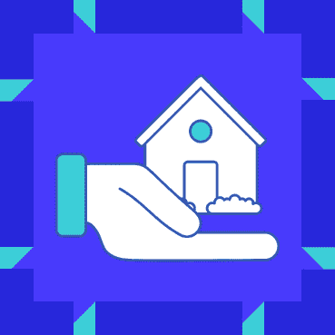
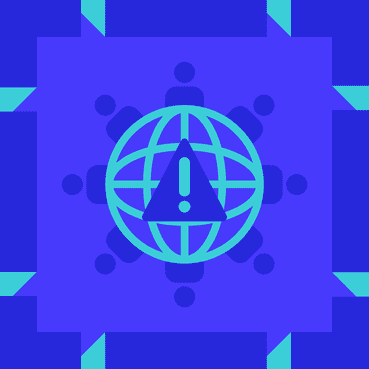

# 区块链神话:行业应用

> 原文：<https://blog.web3labs.com/blockchain-myths-industry-use>

区块链被大多数行业以某种身份使用。因为“没有人在做”而拒绝尝试是不必要的。大多数已建立的项目使用私人和许可的区块链。公开区块链往往不太受欢迎。在本文中，我们将列举一些区块链采用的例子。这些项目拥有正在被积极使用的实时产品。我们按行业列出它们

## **1。理工**

许多科技公司提供区块链即服务(BaaS)。其中有[微软](https://azure.microsoft.com/en-gb/services/blockchain-service/)、[甲骨文](https://www.oracle.com/uk/blockchain/)、[亚马逊](https://aws.amazon.com/managed-blockchain/)。他们管理他们的服务。创建一个区块链很简单，他们处理技术任务。埃森哲、嘉德人寿和雀巢都使用亚马逊的产品。微软的 Azure 产品已经有了像摩根大通、XBox 和星巴克这样的名字。就甲骨文而言，客户包括 EverLedger、CargoSmart 和 Neurosoft。每个供应商都提供一些他们客户的案例研究。这可以帮助其他企业决定选择区块链。

## **2。银行业**

## 

区块链为银行业提供了一个现代化的机会。一个常见的用例是中央银行数字货币(CBDCs)。2020 年，巴哈马中央银行发行了世界上第一个 CBDC，名为沙币。

他们不是第一个提出这个想法的人。英格兰银行率先提出了这一概念。他们正在研究这个话题，但还没有推出任何东西。许多其他央行也对 CBD 表现出兴趣。其中包括中国、加拿大、瑞典、泰国、委内瑞拉和俄罗斯的银行。

## **3。保险** 

保险业饱受缓慢而低效的数据共享之苦。这就是区块链的一个名为 [OpenIDL](https://www.hyperledger.org/learn/publications/openidl-case-study) 的解决方案。该项目将美国保险业的数据连接起来。作为它的基础，它使用 Hyperledger 织物。它能够处理不同的保险业务。它们包括汽车保险、洪水保险、房屋保险和再保险。在海外航运方面， [A.P .穆勒-马士基](https://www.reuters.com/article/uk-blockchain-insurance-marine-idUKKCN1BG3A4)已经与微软在海事保险方面展开合作。该产品名为 Insurwave。它可以实时观察船只，降低保险成本。

## **4。供应链**

对于奢侈品，顾客从增加的透明度中受益。它确保了项目是原始的。此外，它可以保证它不是童工或奴隶劳动的产物。当这些数据放在区块链上时，顾客只需扫码就能看到。这也可以帮助供应链中的其他人跟踪一切。它消除了书面记录，加快了流程。

瑞士软件开发商 aXedras 拥有一个名为 Bullion Integrity Ledger 的区块链平台。它跟踪贵金属，以确保可持续性和完整性。它也有助于保护人权。

A.P .穆勒-马士基也通过 TradeLens 在供应链中掀起波澜。这是他们用于跟踪货物的区块链平台。仅在 2020 年，它就处理了超过 10 亿次的货运。

## **5。医疗保健**

新冠肺炎危机让世界疲于应对新常态。IBM 开发了[数字健康通行证](https://www.ibm.com/watson/health/resources/digital-health-pass-blockchain-explained/)来应对这一问题。这有助于用户与任何需要访问他们的医疗数据的人共享这些数据。这包括雇主、活动组织者、旅行社等。由于每个用户都控制着自己的数据，他们维护着自己的隐私。

## **6。药房**

必须努力追踪药物，因为这可以拯救生命。瑞士制药商诺华是欧盟制药集团的领导者。他们使用区块链让客户通过扫码访问实时数据。在幕后，他们也在追踪假货和黑市。

美国也有一个类似的项目。FDA 已经选择 [BRUINchain 生态系统](https://www.hyperledger.org/learn/publications/ledgerdomain-case-study)作为医药供应链试点项目的一部分。该平台有助于正确配药，同时跟踪过期或假冒药品。

## **7。政府**

## 

网络时代的隐私权是不断发展的。这促使 2018 年通过了《一般数据保护条例》(GDPR)。“该法规的一部分是确保数据的存储和检索是 100%不可辩驳的，” [Joisto](https://www.hyperledger.org/learn/publications/joitso-solution-brief) 说。该公司开发了一个支持区块链的归档，确保所有数据不变。它符合 GDPR 数据保护标准。

## **8。游戏**

Horizon 是一家区块链基础设施公司，致力于创新游戏。SkyWeaver 是他们的旗舰交易卡牌游戏。它是免费的，有 500 个独特的卡和区块链保证所有权。通过创建卡牌，玩家可以互相战斗。SkyWeaver 使用以太坊 ERC-1155 令牌作为所有权的基础。

## **9。房地产**

## 

房屋租赁可能是一个艰苦的过程，包括大量重复性的文书工作。日本的 NEXCHAIN 财团正在利用区块链提供端到端的房屋租赁解决方案。通过一个平台，用户无需代理即可验证身份、支付水电费和查看物业。由于每个相关方共享同一个平台，这一过程更加容易和快捷。

## 10。社会影响

## 

哈拉系统公司是一个试图拯救叙利亚内战中平民生命的项目。他们的哨兵预警系统警告市民即将发生的空袭。该解决方案挽救了数百人的生命，这些数据非常重要，值得报道。通过记录在区块链上，他们可以确保它没有被改变。他们还可以通过以太坊公共网络更快地举报战争罪行。

### **结论**

区块链是针对[特定问题](https://blog.web3labs.com/new-video-what-is-blockchain-great-at)的绝佳解决方案。你可以在任何行业发现这些问题，包括你自己的行业。这些用例适合您的业务吗？我们的例子有没有帮助你认识到新的选择？

要了解更多信息，请注册我们即将举办的[成功区块链部署原则网络研讨会。](https://www.web3labs.com/principles-webinar)主要是，我们将谈论选择区块链时你需要知道的事情。我们也可以回答你的问题。