# 区块链如何帮助我们实现联合国的可持续发展目标

> 原文：<https://blog.web3labs.com/17-ways-blockchain-can-help-us-meet-the-united-nations-sustainable-development-goals>

2015 年，联合国制定了 17 项可持续发展目标。这些相互依存的目标将为 2030 年前所有人的更美好未来铺平道路。在 Web3 实验室，我们相信区块链可以在实现这些目标方面发挥关键作用。这里只是区块链让世界变得更美好的惊人潜力的几个例子。

## 消除贫困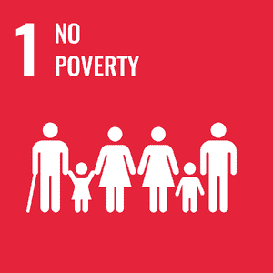

改善穷人和弱势群体生活的一个方法是关注经济资源。区块链将使用包容性系统提供更好的金融服务。

只需一部智能手机，个人就可以拥有一个储值空间，并随时使用支付技术。这些货币将以数字货币的形式出现，与美元或其他相对稳定的法定货币挂钩。

[Celo 区块链](https://celo.org/)就是这样一个例子。它提供了一个开放平台，为任何拥有智能手机的人提供金融服务。

## 零饥饿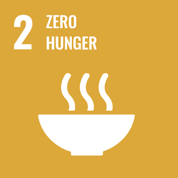

在发展中国家，现金转移经常被用来减少饥饿。但这是有代价的——由于金融基础设施薄弱，分销往往很困难。同样，地方腐败可能会阻止现金到达最终接收者手中。在许多情况下，这些收款人可能没有自己的银行账户，或者缺乏开立账户的文件。

区块链可以帮助这种现金分配。通过取消对银行账户的需求，区块链确保了现金到达预定受益人手中。生物识别等技术将保证只有授权的接收者才能消费现金。

世界粮食计划署推出了一项援助叙利亚难民的区块链试点项目。该计划将提供更多的现金和更多的选择。这提供了更好的财务控制，使现金转账变得简单，而不会泄露受益人信息。此举还促进了与合作伙伴的合作。

## 健康幸福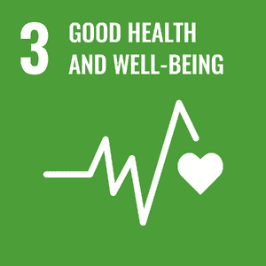

更好地获得医疗保健和药物可以改善总体健康和福祉。区块链可以为药品供应链中的疫苗提供真实性和质量保障。

区块链不仅可用于确保一批供应品的真实性，还可确保它们在运输过程中得到正确处理。例如，必须保持特定的温度，并确保供应不被篡改。

世界卫生组织估计发展中国家十分之一的医疗产品不符合标准或者是伪造的。这为区块链提供了一个巨大的帮助机会。

## 素质教育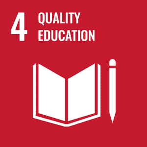

对许多人来说，互联网的接入消除了获得高质量教育材料的障碍。反过来，我们看到了社会经济向上流动和减少贫困的机会。

但仍有工作要做。学习者可能很难证明他们在所选的学习材料中达到了特定的能力水平。欺诈者使情况变得更糟，他们可能会伪造证书。区块链可以提供这里缺失的‘信任层’。

学术机构可以保证区块链的真实性。通过在区块链颁发等级和资格证书，他们避开了任何欺诈活动的机会。这不仅仅是在实体学校上学的学生。

弱势群体或许能够获得高质量的教育内容，但举证责任在他们身上。区块链可以保证他们的证书，让这些学生更好地就业和深造。

ODEM 就是这样一家在线学习提供商。所有证书都存储在区块链上，供完成课程的学员使用。

## 性别平等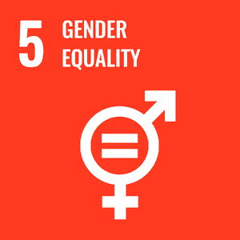

在获得资金方面，男女之间仍然存在巨大差距。今天，全球仍有不成比例的女性没有银行账户。上述获得金融服务的机会将有助于解决这一差距。区块链将为弱势女性提供获得所需资源的途径。

## 清洁水和卫生设施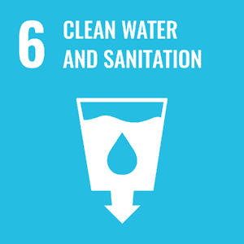

基于绩效的激励措施可能会鼓励更多的社区推广清洁水和卫生设施项目。

个人、社区和公司都将受益于区块链的支付系统。那些参与水质和保护项目的人将获得“积分”奖励。使用更少的污染物会带来经济回报。

区块链还可以用于确保水质测量值与源头测量值相匹配。该技术为随后的测量验证创建读数的“数字指纹”。

德勤和 IBM 在 2020 年初制作了一份关于区块链如何与物联网合作控制水污染的报告。这将确保水仍然适合人类和农业使用。

## 负担得起的清洁能源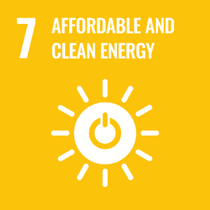

更多地获得清洁能源将减少对化石燃料的依赖。太阳能电池板和风力涡轮机等清洁能源生产资产需要密切监控。他们还需要安全标识符来与电网通信。

通过利用基于区块链的安全标识符和物联网设备，电网运营商获得了额外的保障。他们可以确信与电网通信的能源资产确实是有问题的资产。此外，与水测量一样，他们可以确保报告的能量输出与记录的相匹配。

[沃达丰与能源网](https://www.vodafone.com/business/news-and-insights/blog/gigabit-thinking/iot-and-blockchain-the-new-green-power-couple)合作，使用他们以 SIM 为中心的区块链技术(SCB)来识别对电网有贡献的设备。

## 体面工作和经济增长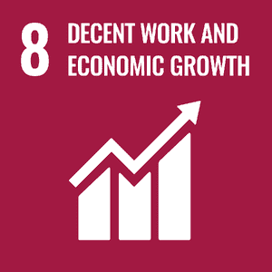

区块链技术及其相关的公共网络可以通过互联网访问。这为知识渊博的企业家创造区块链应用程序提供了重要的机会。区块链将为任何人创造新的机会和工作，无论他们位于何处。

世界上许多个人和公司都在采取这一步骤。例如，许多人在[以太坊平台](https://ethereum.org/en/)—“世界计算机”上构建下一代应用程序！

## 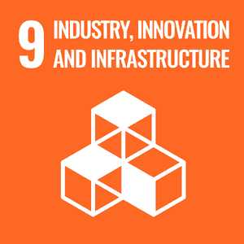工业、创新和基础设施

区块链本身就是一种创新。多个网络正在全球范围内启动，以支持经济发展。这些网络跨越地理边界。它们对任何有互联网接入的人开放——促进所有人负担得起和公平的接入。

推动这些创新的不仅仅是公司和网络，还有行业团体，如 Hyperledger 的[气候行动和会计签名](https://wiki.hyperledger.org/display/CASIG/Climate+Action+and+Accounting+SIG+Home)、Interwork Alliance 的[可持续发展业务工作组](https://interwork.org/the-interwork-alliance-sustainability-initiative-to-develop-trusted-solution-for-standardizing-token-based-carbon-emission-accounting-credits-and-offsetting/)、[气候账本倡议](https://climateledger.org/)、[气候链联盟、](https://www.climatechaincoalition.io/) [开放气候项目](https://www.openclimate.earth/) 和[社会影响区块链](https://blockchainforsocialimpact.com/)。

## 减少不平等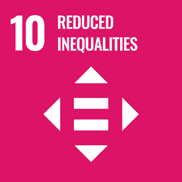

移民利用世界上的汇款走廊将钱汇回自己的国家。与这些支付相关的数字是惊人的。最大的汇款走廊是从美国到墨西哥，2019 年[达到 400 亿美元](https://data.worldbank.org/indicator/BX.TRF.PWKR.CD.DT?locations=MX)。这个数字没有下降的迹象。与这些支付相关的费用通常为 4%，这对另一端收到的实际资金产生了巨大的影响。

除了利润动机之外，其中一个重要因素是处理银行间的全球支付非常复杂。[5%到 20%的付款必须经过运营人员的评估](https://www.ft.com/content/87ae3010-61ec-11e9-b285-3acd5d43599e)才能通过。这延迟了支付，导致银行支付处理的巨大成本，并转嫁到最终客户身上。

基于区块链的支付网络，如 [JP 摩根的银行间信息网络(IIN)](https://www.jpmorgan.com/solutions/treasury-services/payments-and-cross-currency-solutions/iin) ，可以将这种破坏最小化。他们开发了一种机制来实时验证付款是否进入了有效账户。这可以最大限度地减少以后的拒绝，例如由于账号、分类代码、地址或任何其他交易细节的错误。

## 可持续发展的城市和社区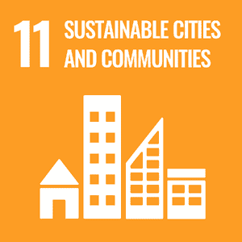

区块链以及人工智能、5G 和物联网技术是更智能、更可持续的城市的关键组成部分。5G 超级连接将促进创新，例如:

-使闲置的电动汽车能够将其备用电池容量贡献给电网

-奖励使用可持续交通工具前往工作地点的员工。

博世[在该领域引领了一系列举措](https://www.bosch-presse.de/pressportal/de/en/dlt-restores-trust-in-the-internet-189824.html)。这将允许设备通过区块链上的智能合约相互独立通信。他们称之为“事物的经济性”。一些好处包括自动向车主收取收费公路使用费、电动汽车充电费和停车费。

## 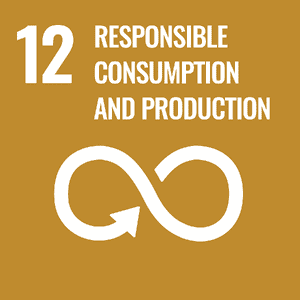负责任的消费和生产

一段时间以来，大公司鼓励可持续发展的势头越来越大。股东和投资者现在都在激励这些机构更新它们的做法。

欧洲可持续投资产品的资产预计将在未来 5 年内达到 7.6 万亿€。特别是，到 2025 年，我们将看到前所未有的 ESG(环境、可持续发展和公司治理)基金。投资 ESG 基金的人和这些基金的经理都需要保证。他们投资的公司的行为必须是可持续的。

提供这种透明度需要准确的报告，这需要大量的书面记录。这种做法确保了 ESG 计划的公司信守承诺，坚持碳抵消等主张。

区块链有很大的机会简化这一报告过程。组织可以使用区块链来验证环境、社会和治理活动的报告，无论是公司购买碳补偿的环境项目，还是他们自己的内部活动。利用区块链的防篡改报告，投资者可以对这些公司的环境实践充满信心。

## 气候行动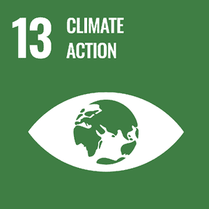

随着温室气体排放的不断增加，越来越多的社区正在努力减少他们的气候足迹。做到这一点的方法之一是自愿碳抵消。这些措施通过抵消温室气体排放来减少温室气体排放，例如植树或使用可再生能源。

当项目创造或铸造碳补偿时，买方需要确定声明是真实的。这些偏差通常由标准机构进行验证。金本位制、Verra、美国碳登记和气候行动储备是最著名的机构。

同样，这需要报告文件记录。在创建时，创建偏移的项目可以使用区块链在源位置记录信息。然后，标准机构可以验证这些信息，并向购买者(如企业)保证抵消创建是真实的。

世界银行的[气候仓库](https://www.worldbank.org/en/programs/climate-warehouse)目前正在开发一个位于区块链的元注册库。这将连接跨越国家、区域和机构登记册的气候市场系统，以增加透明度并建立对气候市场的信任。反过来，这将防止“重复计算”缓解结果，如碳抵消。

## 水下生活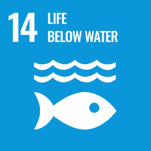

区块链可以对过度捕捞和破坏性捕捞行为产生巨大影响。通过提高渔业供应链的透明度，我们可以确定鱼类的原产地。这有助于我们验证生产商的可持续发展实践。在自动区块链上捕捉这些信息让终端消费者对他们盘子里的食物来源更有信心。这也让我们更好地了解捕鱼的做法。

[出处](https://www.provenance.org/tracking-tuna-on-the-blockchain)就是这样一家公司，他们利用区块链追踪黄鳍金枪鱼和鲣鱼从捕获到消费的全过程。

## 陆地生活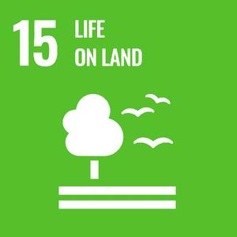

解决森林砍伐和荒漠化问题是维持地球健康的关键。激励和监测对于防止非法砍伐和其他破坏性做法至关重要。根据世界银行的数据，在一些国家，非法砍伐占所有砍伐的 90%。

区块链可以为木材贸易提供更大的透明度和可追溯性。[木材追踪协议](https://wtp-project.com/)正是为了帮助拯救亚马逊雨林。在秘鲁，大部分木材追踪都是用纸完成的。木材追踪协议创建了一个数字区块链系统来取代这种基于纸张的方法，允许买家验证木材的合法性。

这种可追溯性系统对确保买家信心大有帮助。随着透明度的提高，非法伐木活动也会减少。

## 和平、正义和强大的机构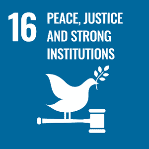

只有 46%的撒哈拉以南非洲人进行了出生登记。数字出生登记系统正被用来帮助提高这一数字。区块链可以通过为这些记录提供“唯一性保证”来进一步改善这一点。区块链的生物识别数据提供了真实性和透明度。

这些数字身份可以帮助“自我主权身份”。个人可以在不共享个人信息的情况下创建和控制凭据。

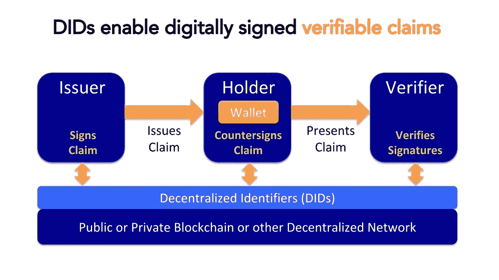(Source: https://en.wikipedia.org/wiki/Self-sovereign_identity)

这种“基于区块链的身份”正由 W3C 的[分散标识(DIDs)](https://www.w3.org/TR/did-core/) 开发，并由[分散标识基金会](https://identity.foundation/) (DIF)提供行业支持。

基于区块链的数字身份不仅仅是提供一个身份。他们还让所有者控制自己的数据。这对于身份所有者来说尤其具有吸引力，为我们过渡到数字身份提供了更大的保证。

## 目标伙伴关系

任何区块链部署要取得成功，都必须有伙伴关系作为支撑。这些可能是地方、国家甚至全球层面的行业、政府或非盈利团体。

如果没有这种级别的合作，我们将保持现状，数据孤岛闭门造车，降低效率。当然，并不是所有的数据都可以共享。然而，我们应该分享我们所能分享的任何数据，以充分利用区块链。推而广之，我们将帮助实现这 17 个目标，包括:*消除贫困、* *保护地球、* *提供更美好的前景、* *改善生活。*

没有正确的立法和政府的支持，这一切都不会发生。我们的目标是提高人们对区块链及其无数机遇的认识。我们相信这项技术是一股向善的力量，它有能力实现这些可持续发展目标就证明了这一点。