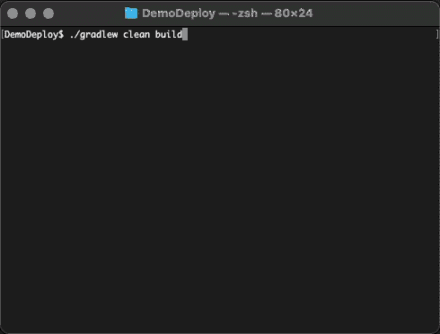

# 使用 Sokt 的 Solidity 版本管理器

> 原文：<https://blog.web3labs.com/web3development/a-solidity-version-manager-using-sokt>

在我上一篇[博客文章](/making-manual-solidity-version-management-a-thing-of-the-past?_ga=2.179662564.1584185553.1584444711-1473220240.1584444711)中，我讨论了每天在不同版本的 Solidity 编译器之间切换所带来的问题。 [Sokt](https://github.com/web3j/web3j-sokt) ，是由 Web3 实验室编写的软件，旨在解决这些问题并简化开发者的体验。好消息是 [Web3j](https://www.web3labs.com/web3j) 现在使用 [Sokt](https://github.com/web3j/web3j-sokt) 库来编译 Solidity 代码。这意味着几乎所有可能的 Solidity 版本都可以在没有用户干预的情况下被锁定！

## 问题是

但是，尽管 Sokt 允许以编程方式高效编译智能契约，但它并没有完全解决我们在处理多个项目时所面临的问题，这些项目都需要不同的 Solidity 版本，通常直接从命令行进行。为此，我们设计了一个基于 CLI 的工具，名为 [svm](https://github.com/web3j/svm) (Solidity 版本管理器)，它利用 Sokt 库从 CLI 安装和管理 Solidity 版本。

## 解决方案

如果您以前使用过 Jabba 来管理 Java 版本，或者使用 nvm 来管理 node.js 版本，那么您应该对这种工具很熟悉。它允许你从命令行轻松地在不同版本的 Solidity 之间切换，并下载和安装新版本，所有这些都不需要离开你的终端。

最简单的交流方式是通过视频:

上面的视频演示了以下过程:

1.  安装 svm
2.  使用它来列出可用的 Solidity 版本，以便从远程列表进行安装
3.  安装和使用 Solidity 0.5.9
4.  安装和使用 0.6.2

所有这些都来自同一个外壳！

也支持创建别名。例如，如果 0.5.9 是某个系统上最常用的版本，您可能希望将 0.6.3 命名为“最新”,或者将 0.5.9 命名为“默认”。在 Windows 或 Linux 上安装带 svm 的 Solidity 时，最新的二进制文件直接从 Github 上的 [Solidity 发布页面](https://github.com/ethereum/solidity/releases)下载。然而，macOS 的原生映像并不在这个页面上发布，所以 Web3 Labs 已经为 [macOS](https://github.com/web3j/solidity-darwin-binaries/releases) 制作并托管了静态链接的构建。

使用 svm 支持的其他命令如下:

| 安装 | 下载并安装 Solidity |
| 卸载 | 卸载坚固性 |
| 使用 | 修改路径以使用特定的实体版本 |
| 目前的 | 显示当前“使用”的版本 |
| 限位开关（Limit Switch） | 列出已安装的版本 |
| ls-远程 | 列出可安装的远程版本 |
| 别名<name></name> | 解析或更新别名 |
| unalias<name></name> | 删除别名 |
| 复员 | 停用当前 shell 中的 svm |

您可能会认为，既然 Sokt 的目标是 JVM，那么就会有 Java 依赖性。但是通过使用 GraalVM，svm 可以作为 Linux 和 macOS 的本机映像。然而，Java 8 对 Windows 的依赖性仍然存在，因为 GraalVM 在 Windows 上还不够成熟，无法为 Windows 上的复杂项目生成可执行文件。

## 装置

我们希望 Sokt 和 svm 将解决许多 Solidity 开发者的一个重大痛点；如果您想试试 svm，它可以像这样安装在 Linux 和 macOS 上:

> 科尔-L https://github.com/web3j/svm/raw/master/install.sh | bash & & source ~/。svm/svm.sh

对于 Windows:

> 【网。ServicePointManager]::security protocol =[Net。安全协议类型]::Tls12
> 
> 调用表达式(
> 
> invoke-WebRequest https://github.com/web3j/svm/raw/master/install.ps1-UseBasicParsing
> 
> ).内容

对于开发人员来说，能够在重复和单调的任务(如管理编译器版本)上节省时间真是太好了。如果 svm 对你有用，你也很可能受益于使用 [Sokt](https://github.com/web3j/web3j-sokt) 将类似的功能集成到你部署的软件中，以及来自 Web3 实验室的其他[开源软件](https://github.com/web3j/)。