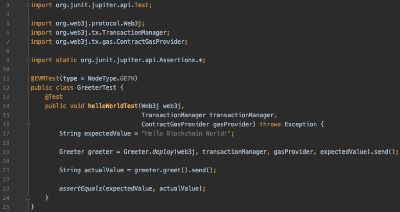
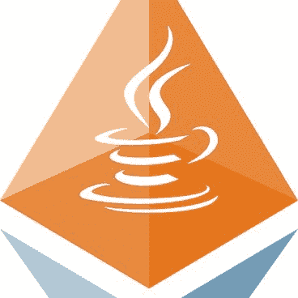
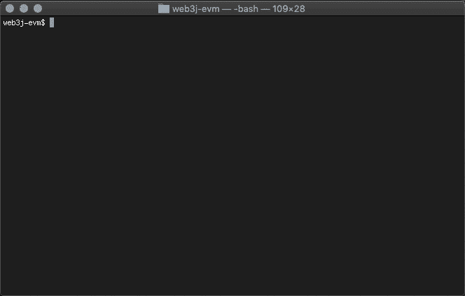

# 如何测试以太坊智能合约

> 原文：<https://blog.web3labs.com/web3development/how-to-test-ethereum-smart-contracts>

作为一名开发人员，我相信您会努力测试您开发的东西，在大多数成熟的编程语言中，您都有一个装满工具的盒子可供选择。然而，在区块链的世界里，盒子仍在建造中，可用工具的成熟反映了这一点。

在 Web3 实验室，我们尽最大努力帮助提高这些工具的质量。在这篇博文中，我将深入探讨作为一名编写以太坊智能合约的 Java 开发人员，我们能为您提供什么。

首先，让我们建立景观。

以太坊区块链是世界计算机，您希望在其上部署您的智能合约代码并与之交互。智能合约本身可以用 Solidity 编程语言编写，因为你不会直接在以太坊区块链上运行 Java。这已经带来了一些挑战，因为我们现在将注意力分散到两个独立的堆栈上。Web3j 可以通过帮助您生成易于访问协议功能的类型安全契约包装器来弥合这一差距。

那很好，但是仍然有许多移动的部分。首先，你需要能够连接到以太坊节点。当然，您不需要对以太坊主网这样做，但是即使是测试网也会带来需要管理的外部配置和设置。

## 那里有一个图书馆

所有这些活动部件都迫切需要一些工具，所以我们将它们打包成一个名为 [web3j-unit](https://github.com/web3j/web3j-unit) 的库。它允许您用 Java 编写测试，自动启动本地以太坊节点并与之交互。本节点由 web3j-unit 库启动，后台管理。n

现在，这是完全自动化的，而不是弄清楚如何安装、配置和运行本地以太坊节点。你甚至不需要知道有一个运行。当测试完成时，节点会自动终止，不会意外留下任何东西

*Easily test Ethereum smart contracts using Web3j-unit*

让上面简单的测试变得特别的是您在第 11 行看到的`**@EVMTest**`类注释。这突出了我们的 web3j 单元库要进行的测试，并让我们创建和注入所需的 Web3j 实例，以及事务管理器和 gas 计算器。在注释本身上，您会注意到类型参数。这定义了哪种类型的节点将开始使用，目前支持 Geth，Besu 和我们的嵌入式 EVM 实现，我们将在下面讨论。

有了这些注入，你就有了一个预配置的和以太坊区块链的良好连接。我们对 web3j-unit 有了一个很好的开始，因为从 Java 测试以太坊智能合约并与之交互从未如此简单。

EVM + JVM = true

## 在 JVM 中运行 EVM 代码

如果您可以在已经运行的 Java 流程中部署 Solidity smart contracts 并与之交互，这不是很好吗？而不是 dockerized 节点，只是一个你可以直接交互的库？

这就是我们目前在 [web3j-evm](https://github.com/web3j/web3j-evm) 库中开发的东西，它带来了几个好处。

首先，不需要启动 docker 镜像，这改善了启动时间和通信延迟。相反，只需使用带有默认`type = NodeType.EMBEDDED`的`**@EVMTest**`注释。

其次，因为我们现在在 JVM 内部运行的 EVM 中运行 Solidity 字节码，所以我们不需要跨越进程边界。这使我们能够检查您的智能契约中发生的所有细节，这对于提供上下文和调试工具非常有用。

*Stepping through EVM byte code for that true low level experience*

上面的 gif 展示了这一操作的早期演示，我们正在逐步执行作为正常合同部署和交互的一部分而执行的单个 EVM 操作码。虽然这可能有点低级，但它确实展示了更高级工具的潜力。我们将分享更多的细节，因为它变得可用。

## 根据测试网进行测试

虽然`**@EVMTest**`注释允许您从单个注释开始运行本地以太坊节点，但是我们也希望您能够轻松地在 testnet 上运行。有时候，在测试网上测试你的契约比简单地在一个孤立的本地节点上测试更有意义，尤其是在进行集成测试的时候。

但是在使用测试网时，还需要一些额外的东西，特别是一个预先准备好的钱包地址和一个你可以连接的地方。当然，获得免费的测试以太网并不困难，但是它确实带来了一些我们想要消除的额外步骤

在不久的将来，当我们围绕这个工具提供一些东西时，我们还会返回更多的内容，但是我们的想法是用覆盖这些内容的其他类型来扩展`**@EVMTest**`注释。