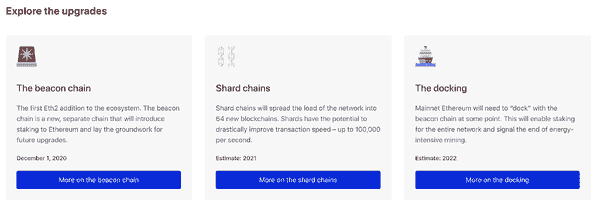
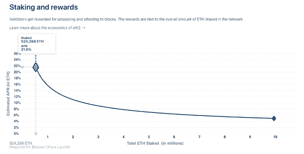
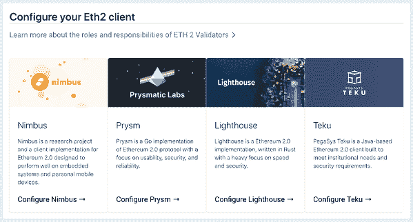

# Eth2 网络即将推出，我需要知道些什么？

> 原文：<https://blog.web3labs.com/the-eth2-network-is-launching-what-do-i-need-to-know>

你可能已经听说了 Eth2 即将推出，这是一个长期计划的以太坊升级。升级分为三个阶段，第一阶段将于 2020 年 12 月 1 日推出，旨在将以太坊的速度、可扩展性、性能、安全性和可持续性提升到一个全新的水平。这也是少数几次人们可以从第一天开始就参与一个新项目，而没有通常的风险保证金，因为以太坊甚至已经在加密货币社区之外建立起来了。

## **三个阶段**

尽管以太坊在其当前版本中完全能够支持运行在其区块链之上的一些被称为 DApps 的去中心化应用程序，但对跨越大多数行业垂直领域的去中心化应用程序和用例日益增长的兴趣要求它不断发展和适应。网络的高交易成本和脆弱性，尤其是在高交易量期间，是升级所针对的主要方面，引入了分片和赌注。

*   **赌注**是从工作证明共识算法(像比特币使用的那样，使用大量电力)到利益证明的转变，这种转变将能效放在首位，只是因为它选择了赌注来达成共识。
*   **分片**意味着以太坊网络将被分成 64 个不同的分片，或平行网络，以提高效率。

The three phases are numbered 0, 1, and 2, with the first one launching at the beginning of December. Each will introduce new upgrades and implementations, leaving enough time to test everything new before moving onto the rest.

*   **阶段 0** 称为信标链。这是新以太坊版本的基础组件，为分片和定位奠定了基础。
*   第一阶段将引入碎片链，而碎片本身的特性将会批量推出。他们将给予以太坊更多的容量来存储和访问跨越多个区块链的数据。
*   **第 2 阶段**，将引入执行环境，并将以太坊主网与信标链合并，实现整个网络的赌注，并开始过渡到完全的赌注证明。它还允许创建新的执行环境，比如 EWASM(Web Assembly 的以太坊变体)来补充现有的以太坊虚拟机。

## **参与第 0 阶段**

尽管第 1 阶段和第 2 阶段分别至少还有一年和两年的时间，但第 0 阶段已经迫在眉睫，对于早期采用者来说，这是一个绝佳的机会。由于以太坊已经被广泛使用，那些一开始就加入的人面临的风险比网络现在刚刚从零开始的人要少，但最终，回报看起来是有希望的。

最好的参与方式是成为验证者。要成为一个完全的验证者，你需要 32 ETH 来激活验证者软件。由此，概念很简单:您的工作是存储数据，处理事务，并向区块链添加新块。如果你工作出色，你将获得更多的 ETH 奖励，但如果你的行为不利于网络的健康，如恶意、不定期更新软件或离线，你将受到惩罚，你的部分股份将被没收(相当于支付给积极参与验证者的奖励)。换句话说，锁定的 32 个 ETH 是你不辍学的动力，而额外的奖励是让你做好工作的动力。然而，需要注意的是，提款不会马上发生。你必须等到第二阶段推出，这预计不会发生在未来 1.5 至 2 年。

入门包括运行 Eth2 软件。Eth2 Launchpad 将引导你完成设置过程，告诉你你的职责是什么，以及什么是验证器密钥(更多信息见下文)。您首先需要一个 Eth1 客户端(Besu、Nethermind、Geth 和 OpenEthereum 都是选项)，它必须与您的 Eth2 客户端( [Lighthouse](https://launchpad.ethereum.org/lighthouse) 、 [Nimbus](https://launchpad.ethereum.org/nimbus) 、 [Prysm](https://launchpad.ethereum.org/prysm) 或[库特](https://launchpad.ethereum.org/teku))并发运行，以处理传入的验证器存款。

所有不同的 Eth2 客户都有自己的 Discord 社区，可以帮助你开始，还有一个名为[r/eth taker](https://www.reddit.com/r/ethstaker/)的 Reddit 社区，你可以在那里找到其他参与者。你的验证器密钥，给你的验证器软件，这样你就可以开始验证，是从一个独特的助记符，也称为种子。助记符可以说是这个过程中最重要的部分:这是你将用来提取你的资金，所以你必须保持它非常安全。

就设置而言，没有更多的东西。Launchpad 为您可能想知道的任何事情提供了深入的信息，包括详细的指南、开始之前应该做的所有事情的清单，以及处理潜在验证者的所有不同查询的 FAQ 部分。

## **遗言**

Beacon Chain 的发布肯定不是你唯一可以参与 Eth2 的时候。然而，最早的采用者将获得最大的回报。当一项新技术被测试和运行时，总是有风险的，但正如一句古老的谚语所说:谁敢，谁就赢。然而，这并不是人们参与新版以太坊的唯一动机:验证者越多，网络就越分散，从而大大提高了安全性。从某种意义上来说，你积极参与一个从长远来看对你的参与有回报的网络，就是在投资你自己的未来。

## **讲解员视频**

如果您想了解更多有关 Eth2 网络发布的信息，并了解如何参与其中，请观看我们的便捷讲解视频。

[https://www.youtube.com/embed/G4hqaxfSV6s?feature=oembed](https://www.youtube.com/embed/G4hqaxfSV6s?feature=oembed)