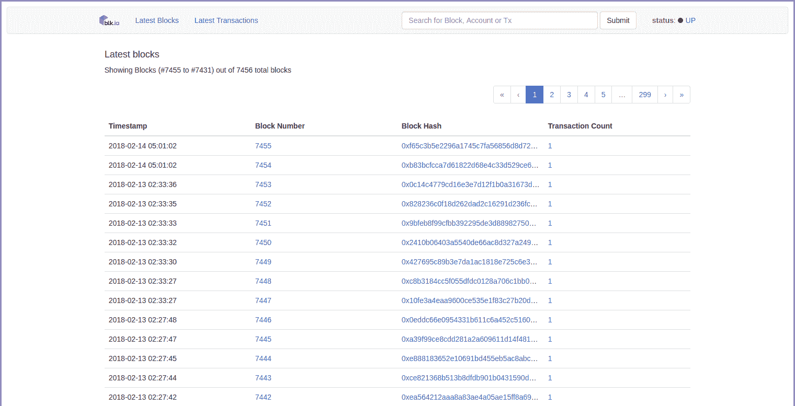
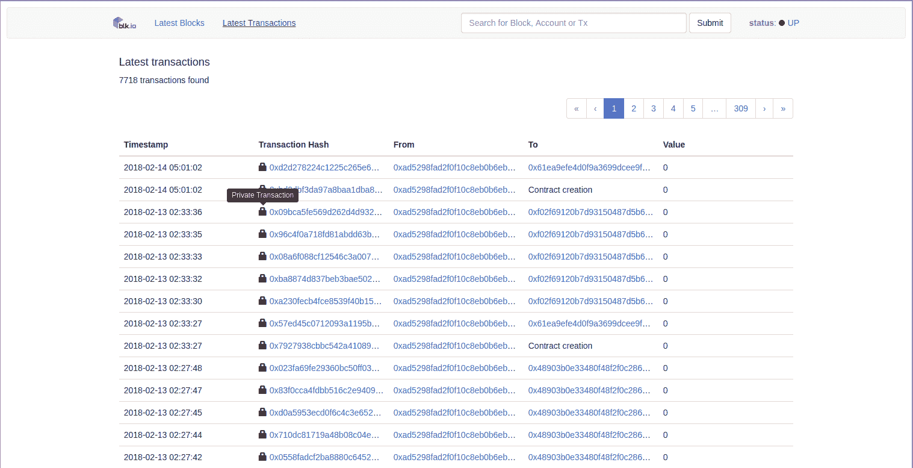
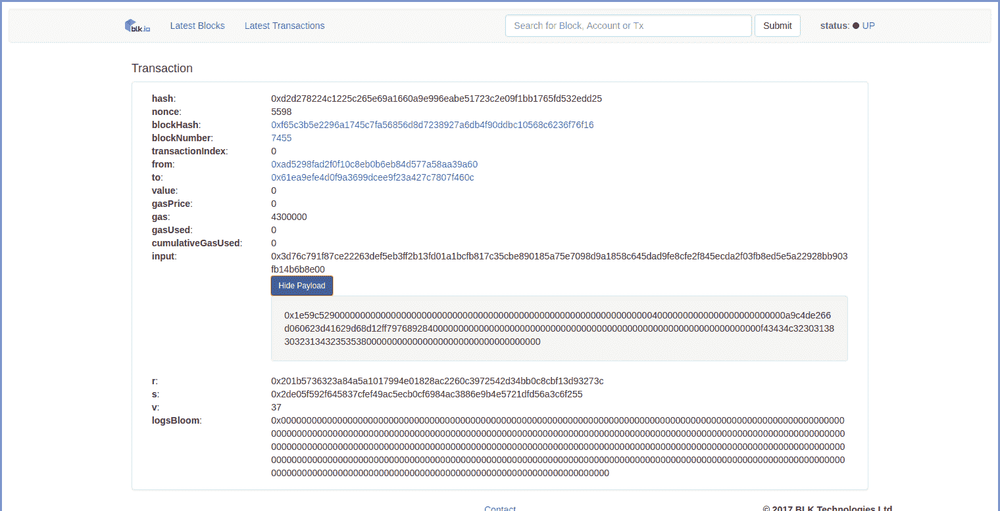
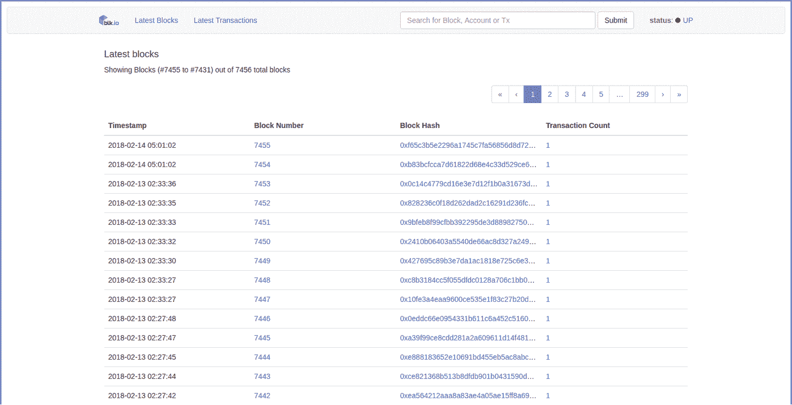
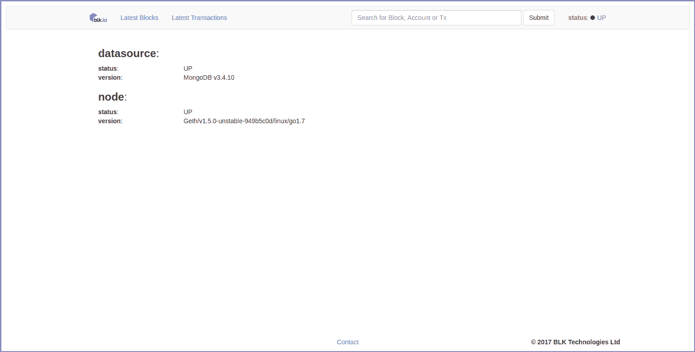
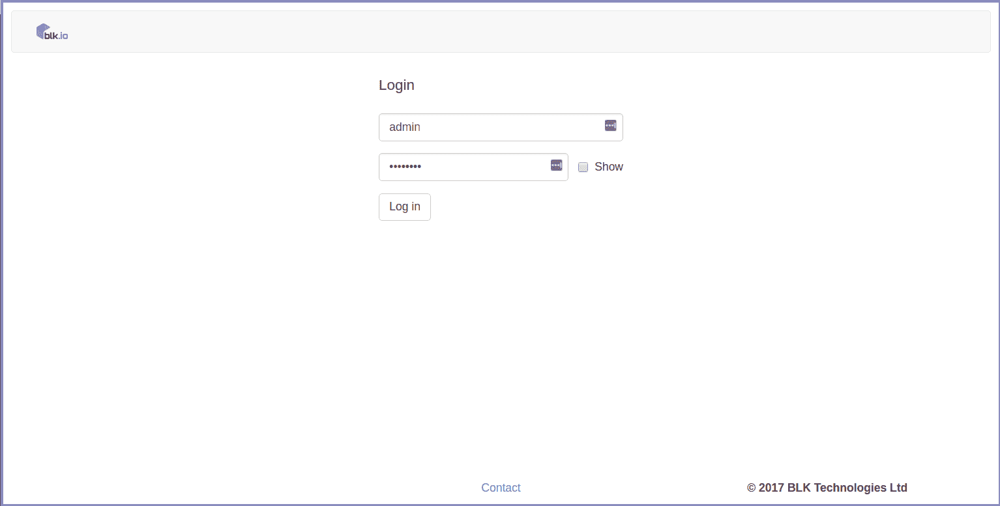

# 我们的免费区块链浏览器现已推出

> 原文：<https://blog.web3labs.com/web3development/our-free-blockchain-explorer-is-now-available>

最近我们[宣布了](https://medium.com/blk-io/announcing-our-blockchain-explorer-ad9ef47cc3e0)我们的区块链浏览器，用于与私有以太坊和法定网络合作。我们很高兴地宣布现在有一个免费版本[可用](https://github.com/blk-io/blk-explorer-free)。

## **浏览你的区块链**

任何使用私人以太坊或法定网络的人现在都可以将我们的浏览器接入他们的网络，并轻松浏览他们的区块链。

这使得在一个简单干净的界面中显示区块链的可视化表示变得非常简单，而不必求助于命令行！

## 特征

**Blocks:** 一启动浏览器就开始查看最相关的信息。



*Latest Block view*

**事务:**最近的事务也有一个简洁的视图，挂锁代表法定网络上的私人事务。



**私人事务:**免费版 explorer 的关键区别在于，它在定额网络中提供了私人事务的可视化表示。目前没有其他浏览器支持这一功能。

***注意:***Quorum v 2 . 0 . 0 目前不支持此功能，Quorum 团队正在针对此问题开发[修复程序](https://github.com/jpmorganchase/quorum/issues/221)。



搜索:没有一些漂亮的搜索功能的浏览器是什么？在导航栏的搜索框中按块号、块散列、交易散列或帐户地址进行搜索。



**状态:**导航栏中的便捷状态链接允许快速查看浏览器的当前状态。如果您有任何问题，请不要犹豫，通过页脚的联系链接给我们发电子邮件。



## 为什么你会使用它

简单:我们一直在努力工作，以确保快速、轻松地运行浏览器的实例。先决条件已经保持在最低限度，事实上您只需要 Docker 和一个以太坊/法定节点就可以开始了。

**快:**探索者已经过在许多实时网络上的彻底测试，包括那些跨越数百万个块的数百万个事务和高达每秒一个事务的吞吐量。即使在如此恶劣的条件下，数据呈现的速度也快得惊人。

## 它是如何工作的

该系统由三个 Docker 容器组成，旨在快速启动运行，一旦克隆了 repo，只需一个命令。

```
git clone https://github.com/blk-io/blk-explorer-free.git
cd blk-explorer-free
NODE_ENDPOINT=http://<node_endpoint> docker-compose -p up 

```

然后前往 [http://localhost:5000](http://localhost:5000/) 开始使用。

整个过程只需要几分钟！要了解更多信息，请访问[项目库](https://github.com/blk-io/blk-explorer-free)。

## 企业功能

我们有许多免费版浏览器没有的附加功能。这包括使用 LDAP、Active Directory、OAUTH 和 Kerberos 等服务的智能合同注册和身份验证支持。



我们可以在 SaaS 为您举办探险活动。

如果你想了解更多关于浏览器完整版的信息，请[联系](mailto:hi@web3labs.com)。