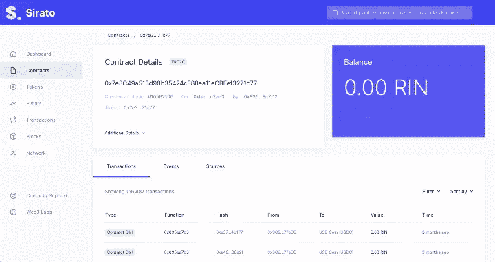

# 伊庇鲁斯变成了希拉托

> 原文：<https://blog.web3labs.com/block-explorer-sirato>

几天前，我们将我们的区块链探索者产品 Epirus 更名为 sira to T1。与此同时，我们正式发布了 Sirato，支持 **VMware 的** [**以太坊区块链**](https://octo.vmware.com/vmware-blockchain-v1-8/) Beta 1 版本，进一步扩展了我们对 EVM 兼容区块链解决方案的支持，这是我们非常兴奋的事情。

*Sirato Blockchain Explorer Dashboard*

我们从中获得灵感的查尔斯·西拉图是一位匈牙利诗人、艺术理论家和翻译家。他最著名的是撰写了**维度主义宣言**。

维度主义倾向导致了-

*   文学离线入面。
*   绘画离开飞机进入太空。
*   走出封闭、静止形态的雕塑。
*   …对四维空间的艺术征服，迄今为止，这种征服完全没有艺术可言。

随着维度的增加，更多联系的丰富性和更深的意义显现出来。通过区块链探险家希拉托，我们看到了丰富和更深刻的意义，因为我们希望提供超越区块链的见解。

*带有模拟数据的 Sirato 仪表板*

想象一下用私有数据丰富公共区块链数据—根据您的需求和要求提供更大的背景信息。然后想象一下，不仅能够在 Sirato 本身的范围内查看这一点，还可以将其作为一个更大的生态系统的一部分，其中包括 API、数据仓库和商业智能工具和管道。

这是我们提供给 Sirato 的。不仅仅是另一个区块链探险家，而是让你获得更多的见解，更丰富的东西。

*Sirato 合同视图*

随着我们越来越多的金融交易和业务伙伴关系被区块链网络清晰地定义，这种见解将变得至关重要。但是区块链只代表管道，如果没有仪器和监控，它就变成了另一个黑匣子。Sirato 打开了这个黑匣子，给你一个了解其内部工作的窗口。随着维度的增加，为了你的利益，这些内在工作被标记、描述和增强。