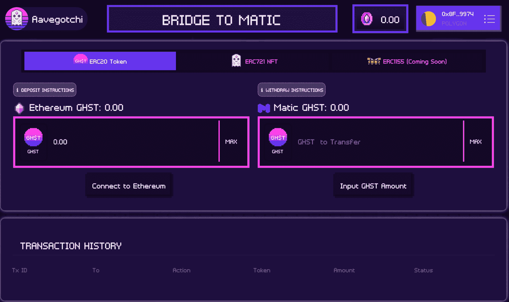

# 区块链跨链互通

> 原文：<https://blog.web3labs.com/blockchain-cross-chain-interoperability-blockchain-networks-connected-by-bridges>

互操作性是一个早在互联网出现之前就已经讨论过的话题；异构系统相互通信的能力对于这些系统的运行是必不可少的，不仅在软件领域，在其他领域也是如此。区块链生态系统的加速发展和平台数量的增长导致了范围有限的单个区块链网络以及数据和资产孤岛的激增。

以太坊成为世界全球计算机的愿景在很大程度上取得了成功；60%的 DApps 运行在以太坊 mainnet 上。然而，它的成功也有局限性，很明显，一个区块链统治所有国家是不够的。

“网络的网络”区块链是一个模型，已经由 Polkadot 生态系统和 ICON 通过他们的 BTP 协议等项目实现-其他关键的区块链平台如 Cosmos、Wanchain 和 Weaver 都是为互操作性而从头设计的。这些平台基于不同的技术堆栈，并且专门用于特定的用例。例如，Polkadot 基于分片网络、可组合区块链层和中继链，ICON BTP 提供了标准协议和 SDK，简化了实现网络中继的过程。所有这些平台都依赖桥来实现跨链的互操作性。

## 为什么要跨链互操作？

区块链的前提是点对点网络，其核心是一组分散的节点一起通信，以保护网络和处理交易。跨链互操作性可以通过实现连接和分散网络的全球生态系统来进一步扩展这一前提。

单个网络可以从通过安全的集中式协议连接的全球区块链生态系统的网络效应中受益。

开发者和用户将不会被他们喜爱的区块链网络的边界所限制，而 DeFi 用户和交易者将获得更大的流动性池。

### 交叉链桥

网桥可以被视为跨链互操作性的基础技术，而不是强制两个不同的区块链直接通信，网桥通过适应每个区块链的安全性或协议来实现跨链通信。这意味着大部分工作是在网桥中完成的，而最小的更改是在区块链(源和目的网络)上完成的

区块链桥分为两类:联合的和无信任的。第一种是集中式的，依赖于可信的保管人来操作和管理桥，操作者通常是私人托管桥的实体或公司；后者是去中心化的，任何人都可以部署一个新的桥或者参与现有桥实例的操作。参与分散式网桥类似于在以太坊中运行验证器，网桥操作员因参与成功中继网络间的交易而获得奖励或费用。

任何桥梁的力学通常依赖于两个原则:

*   传输的数据需要有证据
*   必须保留交易的身份和不变性。

实质上，当交易从区块链 A 转到区块链 b 时，必须尊重协商一致的结果

### 桥梁用例

跨链网桥允许区块链用户跨不同网络使用各种 DApps，而无需完全迁移或切换他们的资产。DeFi(分散金融)尤其是对跨链桥技术兴趣增长的主要驱动力。网桥也是第 2 层可扩展性的关键，因为它们支持第 1 层、[多边形](https://polygon.technology/technology/)之间的通信，L2 扩展解决方案的成功主要归功于支持以太坊和多边形区块链(Matic)之间的双向网桥

### 跨链资产互换

这仅仅意味着在不同的区块链之间移动相同的令牌。这通常涉及一种“锁定和烧毁”机制，以确保令牌在整个链中的分布是一致的。

跨资产交换桥的例子有[币安智能链桥](https://www.binance.org/en/bridge)和 Aavegotchi Matic 桥。

Aavegotchi 以太坊到 Matic

### 链间流动性

自从以太坊的推出和资产令牌化的引入，交易者对获得全球流动性敞口的需求导致了分散交易所和更可靠的价格获取方法的进步，如[神谕](https://ethereum.org/en/developers/docs/oracles/)。

资产令牌化的一个显著例子是[包装的比特币(WBTC)](https://decrypt.co/resources/what-is-wbtc-explained-bitcoin-ethereum-defi) ，这个由 BitGo、Ren 和 Kyber 联合推出的项目通过完全依赖 BitGo 作为托管人，在区块链以太坊上维持了 BTC 和 WBTC 之间 1:1 的令牌储备，这破坏了分散化，因为我们需要信任单个实体来处理 BTC 储备的铸造和锁定过程。

[Ren](https://renproject.io/renvm) 于 2020 年推出 renBTC，并为 WBTC 提供了分散式替代方案，其解决方案基于开放协议，允许任何人操作 RenBridge 来验证和确认传输。

### 可量测性

对可扩展性解决方案的需求增加了区块链互操作性挑战的另一个方面，现在被称为第 1 层的主要区块链网络充当信任层并拥有大部分抵押品。为了在像以太坊主网这样的现有网络上扩展，昂贵的计算将需要离线进行。

[第 2 层](https://blog.web3labs.com/scaling-the-ethereum-network-a-primer-on-layer-2)像 Arbitrum、乐观和 zkSync 这样的汇总扩展解决方案实现了 L1 < > L2 桥接机制，以允许 L1 和计算层 2 之间的通信。通用模型是基于用户通过网桥将令牌存入第 1 层，而链外计算正在进行中，一旦 L2 交易完成，它们将为 L1 提供证据来验证这些交易的后状态完整性。

### 结论

跨链网桥将在实现异构网络之间的互操作性方面发挥重要作用。一个真正的全球区块链基础设施和生态系统将通过桥梁连接起来，这将进一步加强单个网络的安全性并支持可扩展性。如今，区块链的领先项目和 DApps 正朝着多链商业模式发展。如果你想了解更多关于区块链技术的未来，请查看我们的[博客](https://blog.web3labs.com/)或者听听我们的[区块链创新者播客](https://podcast.web3labs.com/)。