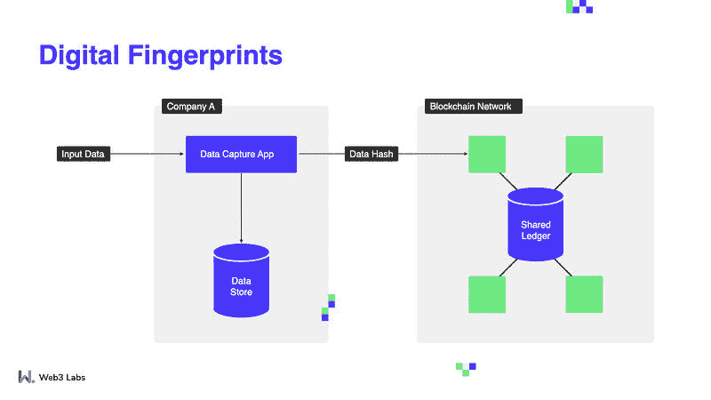
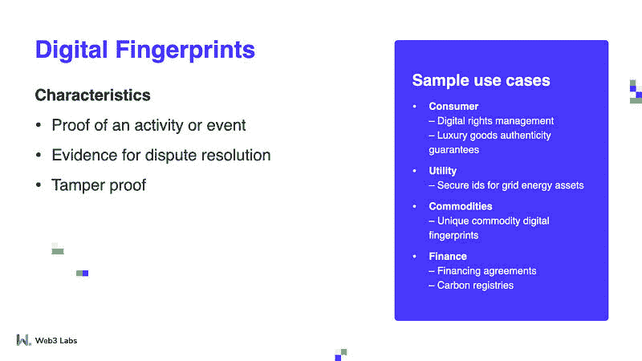

# 为什么应该将区块链用于数字指纹

> 原文：<https://blog.web3labs.com/digital-fingerprints>

区块链擅长证明事件发生过。当新数据被写入区块链时，它与所有其他记录不可分割地联系在一起，即使是最小的细节变化也会改变在它之后写入的后续数据的结构。换句话说，区块链非常适合解决冲突和保证真实性等任务。

对于更传统的主流数据存储和捕获技术，最大的问题之一是外部方无法保证他们所获得的数据的准确性。由于它可能以某种方式被篡改，这就需要对其他记录进行更深入的审计和手动验证，这些记录同样容易被篡改。根本没有简单的方法来解决围绕某件事是否发生的争议:每一方都受到自身利益的驱使，会有自己的观点。

## **区块链如何帮助**

****

正如我们上面提到的，区块链是防篡改的——改变任何东西都会改变一切。由于区块链也是透明的，对数据的修改对每个有访问权限的人都是可见的。因此，一旦事件发生，该事件的数字指纹可以记录在区块链中以供将来参考。有了这种安全性和透明性，它就成了所有相关人员的唯一信息来源，从而大大减少了审核、验证和保留多份记录所需的时间和成本。

区块链在许多涉及数字指纹的真实案例中表现出色。其中之一是数字版权管理:区块链可以保护数字内容的版权，并在侵权的情况下提供跟踪工具。此外，该技术还可以作为记录任何所有权变更和其他相关数据的系统，正如我们在关于所有权记录的文章中所述。

日本电子巨头[索尼宣布](https://www.forbes.com/sites/amazonwebservices/2019/11/19/how-sony-is-protecting-rights-of-digital-creators-using-blockchain-on-aws/?sh=e89f373d2c9f)他们正在利用这项技术来帮助管理与版权相关的信息。任何记录内容的用户都可以看到作者的信息，以及创作的时间和日期。他们还表示，教育内容是一个主要的用例，因为该领域可以从增加的透明度和效率中受益。

为奢侈品提供真实性保证是另一个充满潜力的领域。随着仿制品和假冒商品的大量出现，其中一些甚至可以被当作真货，除非买家非常有经验，拥有无可辩驳的证据证明该商品是根据标准养殖、开采或生产的会有很大的帮助。此外，使这种记录普遍可用将大大有助于完全杜绝伪造，因为它们不能提供这种真实性记录。

钻石是一种商品，它可以极大地受益于供应链透明度的提高(我们在[复杂业务流程](/how-blockchain-simplifies-complex-business-processes)中介绍过的另一个主要区块链用例)，也可以受益于证明它们的采购符合道德规范。在这个行业中，透明性正迅速成为一种必须而非可选的特性。 [Everledger](https://www.everledger.io/industry-solutions/diamonds/) 提供了一个钻石追踪平台，美国零售商 Fred Meyer Jewelers 利用该平台展示了 [RockSolid](https://rocksoliddiamonds.net/journey) 系列珠宝的旅程，该系列后来在美国的 100 家商店出售。

在我们的[所有权记录](/why-blockchain-is-great-for-records-of-ownership)文章中，我们提到了排放补偿，因为它们受益于能够追踪从创造者到购买者的所有权。他们还可以加入数字指纹，让购买碳排放补偿的公司可以完全追溯补偿最初产生的地方，再次向潜在买家提供真实性的印章。

FlexiDAO 是一个总部位于区块链的平台，让能源零售商销售更清洁、更便宜的电力，为他们提供原产地证书、基于市场价格的智能消费和电网平衡服务。这也让客户能够实时跟踪他们的绿色能源，极大地提高了该领域的透明度。

他们远不是这个领域的唯一参与者:专业服务公司毕马威(KPMG)正在研究一个名为气候会计基础设施(CAI)的区块链解决方案，该方案将让公司通过测量和报告温室气体排放来解决它们的问题，但也可以根据收集的数据进行抵消。该解决方案将结合由 Allinfra 提供的区块链平台，以及由 Prescriptive Data 提供的人工智能、机器学习和物联网(IoT)传感器的组合，该公司通过其智能建筑软件支持可验证的排放数据。

## **常见异议**

****

即使有我们列出的优势，使用区块链的想法也会给潜在用户带来一些顾虑。

*   ****谁能确定数据没有被篡改？**当一条新记录被添加到自动区块链时，会创建一个哈希或数字指纹。这个散列依赖于已经存储在那里的所有信息。如果任何信息发生变化，哈希就会崩溃，使得其他所有信息都不可用。当底层数据被检索时，可以简单地对照存储的数字指纹进行验证。** 
***   **我们已经有了数字指纹/哈希来验证关键活动的真实性。**这是一个很好的开始！然而，除非这些数字指纹在区块链上，否则外部组织没有证据证明这些数字指纹没有被修改以匹配所提供的数据。**

 **简而言之，使用区块链来存储发生过的事件的数字指纹提供了一个无法篡改的真相来源。这可以减少审计和验证所提交的数据所需的时间，以及与此相关的成本(尤其是在通常需要第三方的情况下)。

### **最终想法**

正如我们在这里讨论的，区块链作为数字指纹的真实来源的机会是巨大的。我们很想听听您对此的看法——您认为这项技术在哪里使用得最多？如果您有兴趣了解更多关于区块链以及它如何解决不同业务中的常见问题，您可以报名参加我们即将举办的[成功区块链部署原则网络研讨会](https://pages.web3labs.com/principles-of-successful-blockchain-deployments-webinar)。我们涵盖了许多核心用例，并以真实世界的例子来支持它，因此您可以亲眼看到该技术的好处。**