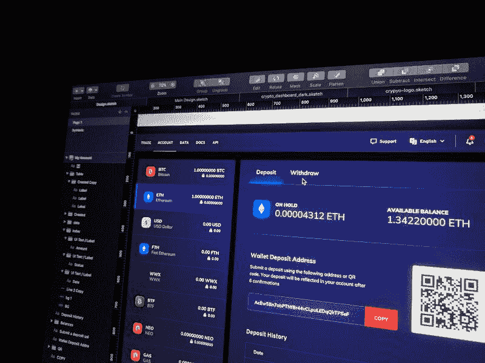

# 区块链的未来——10 年后

> 原文：<https://blog.web3labs.com/future-of-blockchain-10-years-from-now>

这是新的一年的开始，也是回顾过去一年的好时机。我们想分享一篇 2020 年以前的帖子，在那里我们推测了区块链未来几年的样子。你认为我们的预测是真的吗？请在下面的评论区告诉我们。我们很想听听你的想法。

## 现在是 2030 年...

自分散金融(DeFi)协议及其后续治理结构爆发以来，已经过去了 10 年。在 2020 年，我们才刚刚开始建立对这些协议的信任，把它们放在公共领域。我们很快就认识到了他们的企业能力，例如:

*   金融
*   供应链
*   气候倡议

快进到 2030 年，我们将看到区块链被用作科技项目的核心组成部分。采用这些技术的企业和政府部门已经取得了巨大的进步。

## 为了更美好的世界的超连接

到目前为止，大多数主要供应链都是由区块链驱动的。在这样做的过程中，他们将许多碳登记册联系起来，这些登记册已被证明有助于追踪排放抵消。另一个好处是对其他国家的连锁反应。我们现在已经看到企业在帮助各国遵守联合国的《巴黎协定》方面取得了显著进展。

我们剩下一个强有力的三连胜:

1.  用于捕获数据的物联网(IoT)
2.  用于数据验证的区块链
3.  人工智能(AI)用于验证

这些合力有助于解决许多“最后一英里”项目，这些项目扰乱了许多碳抵消计划。

### 区块链和 5G

随着 5G 的广泛采用，许多其他行业已经开始提供设备之间的超连接。这在移动领域掀起了波澜。

闲置的电动汽车能够将其备用电池容量贡献给电网。与此同时，长途汽车旅行正在得到优化。他们现在能够平衡乘客休息和充电站的可用性，从而减少旅行时间。

## 互联网的信任层

区块链通过在设备、人和组织之间提供一个新的“信任层”，加速了网络安全的创新。这些进步以前根本不存在。区块链已经成为互联网 TCP/IP 应用协议之上的一个新的基础层。这导致了更好、更有效的服务的广泛发展。当然，互联网的许多核心管道——TCP/IP、DNS、TLS 仍然存在。然而今天，加密曲线已经被增强以抵抗量子计算。这本身就接近成为一项“有用”的技术。成千上万种不同的区块链协议存在于互联网的不同角落；然而，两大巨头仍然占据主导地位:比特币和以太坊。

## 效率与中断

Tim Wu [十年前总结的。每一项现代通信技术最终都屈服于政府和企业的控制。](https://www.goodreads.com/book/show/9155566-the-master-switch)

分权的区块链也未能幸免。像之前的互联网一样，大多数区块链被推到了舞台中央。其中少数人设法保持了真正的分权。它源于一个老生常谈的问题:用户粘性。就像消费者会从一个移动应用程序跳到另一个一样，去中心化的平台也面临着类似的挑战。更糟糕的是，用户可以“随身携带数据”。

## 密码交易脱颖而出

回到 2020 年，我们看到这种未来的种子正在播种。加密交易应用和支付卡呈爆炸式增长。他们为用户提供了一种赚取、持有和投资加密货币的简单方式。发达国家由赤字推动的通胀导致了法定货币回报率的停滞。这鼓励了越来越多的人尝试加密，以获得更好的储蓄回报。

某些创新很有可能改变基础金融基础设施的运作方式，例如央行数字货币、支付和 T+0 结算。通过可信任的中间人实现双边和解是过去的遗留物。2010 年代也出现了类似的模式，SaaS 平台的出现将软件从托管数据中心推向了云端。

但最终，这些创新为它们所服务的市场带来了更高的效率。他们在这个过程中移除了一些中介，但并没有取代整个系统。在这种情况下，我们可以说，密码是一场“失败的革命”。

## 企业协议

对于企业来说，这是一幅更为乐观的画面。大型跨国公司依然存在，随之而来的是大量核心企业区块链协议的蓬勃发展。Quorum、Fabric 和 Corda 占据主导地位。许多其他协议正在流通，但这些早期平台的社区和先发优势的结合有助于巩固他们的地位。

他们已经大规模运行了许多年，并帮助支持了无数的过渡。例如，我们现在看到欧洲大部分地区、美洲和中国的央行数字货币(由其区块链服务网络支撑)。

以太坊 2.0 对公共协议的采用也飞速增长。这使得企业能够在公共网络上以安全、快速的方式进行交易，这是基线协议首创的方法。这类似于 VPN 如何让组织在互联网上安全运行。

## 新常态

然而，并不是每个人都走这条路。一些公司继续倾向于完全控制其底层基础设施，但不幸的是，这会增加整个网络的成本。但是技术创新总是如此，选择正确的解决问题的技术是关键。

幸运的是，到 2030 年，区块链不再是工具箱中闪亮的新工具。这已经证明了它的价值，并且在经验上是可靠的。在某些情况下，它甚至让人们回忆起“过去的好时光”——在一个没有区块链的世界里克服低效和变通。

有任何问题或意见吗？请随时给我们留言。如果你想更多地了解区块链这个神奇的世界，它的成长和最新发展，那么请查看我们的[博客](https://blog.web3labs.com/)或收听我们富有启发性的[区块链创新者播客](https://podcast.web3labs.com/)。