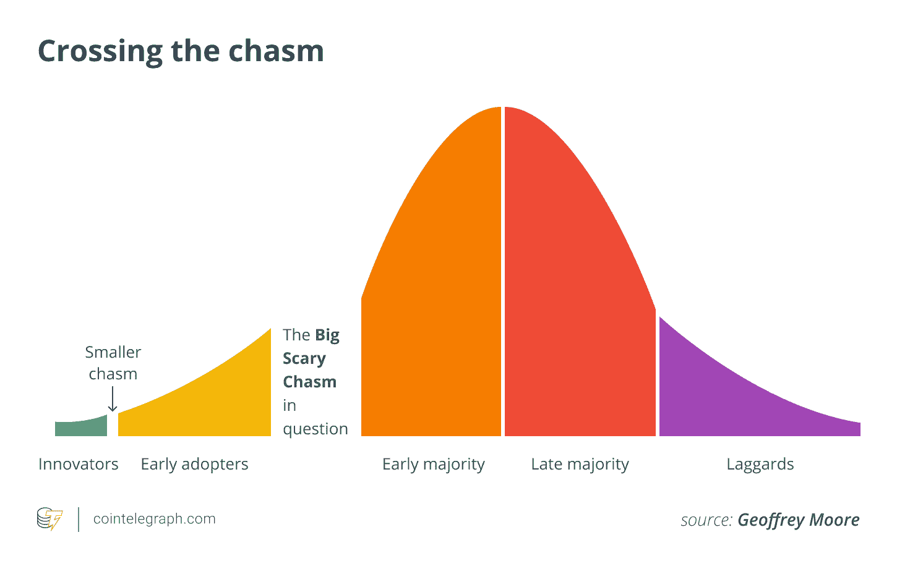

# 区块链跨越鸿沟了吗？早期多数阶段

> 原文：<https://blog.web3labs.com/has-blockchain-crossed-the-chasm-the-early-majority-phase>

在我们之前的[系列](https://blog.web3labs.com/whats-next-for-blockchain-7-emerging-trends)中，我们窥探了区块链的未来，以及我们正在目睹的和未来几年可以预期的新兴趋势。其中包括[第三代平台](https://blog.web3labs.com/whats-next-for-blockchain-3rd-generation-platforms)、[分散自治组织(Dao)](https://blog.web3labs.com/whats-next-for-blockchain-decentralized-autonomous-organizations-daos)、[分散身份机制](https://blog.web3labs.com/whats-next-for-blockchain-decentralized-identity)、[物联网(IoT)](https://blog.web3labs.com/whats-next-for-blockchain-internet-of-things) 、[可信记录系统](https://blog.web3labs.com/whats-next-for-blockchain-trusted-systems-of-record)，以及更广泛采用的[隐私技术](https://blog.web3labs.com/whats-next-for-blockchain-wider-adoption-of-privacy-technologies)。在这个系列中，我们将看看区块链目前在大规模采用方面的进展。

由于 2020 年和 2021 年机构对 DeFi 市场的兴趣不断增长，其锁定的总价值(TVL)已达到数十亿美元。这促使人们观察到区块链的增长率是互联网的两倍。

考虑到以上因素，看起来我们即将大规模采用区块链技术。我们似乎也处于杰弗里·摩尔所说的技术采用生命周期的第三阶段，被称为早期多数阶段。

根据 Moore 的说法，每个技术生命周期都遵循五个阶段，由五个不同的组来标记。第一阶段是创新者——技术爱好者修补新技术，但对市场不太感兴趣。紧随其后的是早期采用者，他们寻找新机会，发现新技术，并愿意承担风险。

区块链似乎已经成功跨越了鸿沟，并进入了第三阶段，在这一阶段，早期的大多数人在采用技术之前都会仔细评估技术。这个阶段之后是后期多数派，确保技术在使用之前已经很好地建立。处于最后阶段的是落后者，或者说是后来者。

来源:[币报](https://cointelegraph.com/news/crossing-the-crypto-chasm-paving-the-way-to-mass-adoption)

## 区块链技术正在大规模采用

处于第三阶段，区块链和加密货币已经从 2010 年代初的水平走了很长一段路，当时只有加密爱好者知道这些是什么。其他人要么一无所知，要么根本不理解这些概念(所谓的创新者阶段)。

然后，从 2015 年开始，随着以太网(ETH)等替代加密资产的发展，早期采用者开始对它们产生兴趣。在接下来的五年里，区块链和加密资产开始稳步攀升，在 2020 年进入早期多数阶段，这是由首次发行硬币(ico)引领的。这时，Square 和 PayPal 等主要机构注意到了这项技术，并开始快速推广。

区块链如何与早期的多数派合作，将决定它的成败。像任何创新一样，区块链和加密货币的采用需要消费者行为以及相关基础设施的重大变化。幸运的是，早期的大多数人渴望了解新技术，他们最初的怀疑可以用一个令人信服的故事来消除，用他们自己的话来说。

这就是媒体发挥最重要作用的地方。它向公众编织和传播这个故事，并教育他们新技术及其用途。这需要在三个方面进行“攻击”:

*   用简单的术语阐明什么是区块链和加密货币；

*   获得有影响力的人的支持；

*   让感兴趣的人熟悉竞争(比如银行、股票、美联储——任何对压制加密货币感兴趣的人)。

在过渡到后多数阶段之前，区块链和加密货币还必须证明自己是可行的，并找到自己的立足点。在他们的案例中，消费者希望快速进行跨境交易，不需要高额费用，也不需要中间人。这一需求在尼日利亚、伊朗、阿根廷和土耳其等消费者面临经济和政治不稳定的国家最为明显。

## 在互联网时代，区块链的采用速度比互联网更快

DeFi 市场已经价值数十亿美元，但仍有很大的增长空间。从我们看到的情况来看，这种增长甚至比互联网在网络时代的增长还要快。这也是 Real Vision CEO 兼宏观大师 [Raoul Pal](https://dailyhodl.com/2021/10/06/real-visions-raoul-pal-says-crypto-will-spark-the-largest-generation-of-wealth-in-the-shortest-period-of-time/) 的观察。

他指出，当互联网拥有 1.5 亿用户时，它正以每年 63%的速度增长，这是有史以来采用技术最快的一次。直到区块链。这项新技术已经打破了记录，因为现在它拥有大约 1.5 亿用户，这意味着它的年增长率为 113%，是互联网采用率的两倍。通过简单的数学计算，到 2024 年，区块链用户的数量将达到 10 亿，到这个十年结束时，我们可能会看到 35-40 亿人。

在撰写本文时，全球加密货币的市值为[2.77 万亿美元](https://www.coingecko.com/en)。现在，与大多数主要资产类别(股票、债券、房地产)的 150-300 万亿美元相比，这似乎不算什么。然而，Pal 认为，加密市场的市值将增长 100 倍，与这些领域相匹敌。他粗略估计，这一数额将接近 200 万亿美元。

除了摩尔的鸿沟，区块链还遵循了高德纳的炒作周期——技术的成熟和采用改变了社会和商业格局的图形表示。Gartner 称区块链的趋势为“算法信任”,并展示了它在启蒙运动的斜坡上攀升。

在这个阶段，技术的更多好处开始具体化，并被公众更好地理解。越来越多的企业投资项目，而更保守的公司仍保持谨慎。

这一阶段跟随幻灭的低谷(兴趣的减弱和最有弹性的生存)，最终将跟随生产力的平台期(主流采用)。

来源: [Gartner](https://blogs.gartner.com/avivah-litan/2021/07/14/hype-cycle-for-blockchain-2021-more-action-than-hype/)

## 又是 90 年代了

摩尔在 1991 年写了他的书。很快，他的想法和观察在互联网的成功中得到了证明。然而，它们现在也适用于(甚至更大的)区块链技术的成功——继万维网之后的下一件大事。

20 世纪 90 年代，许多互联网公司成为网络公司一夜成功的典范，推动了普遍的创业热潮和快速发展。事实上，在 1999 年，每 12 个美国人中就有一个处于创业的特定阶段。

我们正在目睹区块链领域发生的类似事情，每天都有新的想法、公司和项目涌现出来。就像互联网泡沫一样，最弱的可能会失败，但最好的会生存下来，并继续推动区块链的采用。

正如 20 世纪 90 年代所证明的那样，泡沫可能会破裂，许多人可能会随之沉沦，但注入泡沫的基础技术将会存在。因此，即使在网络泡沫破裂后，互联网也从未消失。恰恰相反。

随着许多加密货币的价格在最近几个月暴跌，区块链也是如此。然而，在市场仍处于自我调整的过程中，这种波动是正常的。

### 结论

与此同时，以太坊这样的公共区块链(任何人都可以查看账本、加入并参与共识过程)仍然是公共和企业领域的主导平台。例如，仅以太坊就拥有最多的跨行业用例——[52%](https://www.hfsresearch.com/blockchain/top-5-blockchain-platforms_031618/)——相比之下，表现最好的私有区块链 Hyperledger Fabric 拥有 12%。

随着机构开始意识到公共区块链的力量，这一点尤其如此。具体来说，它有助于向连接到公共基础设施的任何人即时提供商品和服务，提供高度的交易安全性和完全的透明性，并且是完全不可变的。最重要的是，公开的区块链消除了攫取超额利润的控制实体。

他们还意识到如何使用算法信任模型来解决数据隐私和安全问题。这需要分离链外数据，零知识证明，以及私有和公共网络之间的互操作性。

将其他新技术的出现以及 NFT 和 DeFi 令牌的爆炸式增长融入其中，您将获得一个非常有趣的未来。

有任何问题或意见吗？请随时给我们留言，我们喜欢收到读者的来信！如果你想更多地了解区块链这个神奇的世界，它的成长和最新发展，那么请查看我们的[博客](https://blog.web3labs.com/)或收听我们富有启发性的[区块链创新者播客](https://podcast.web3labs.com/)。