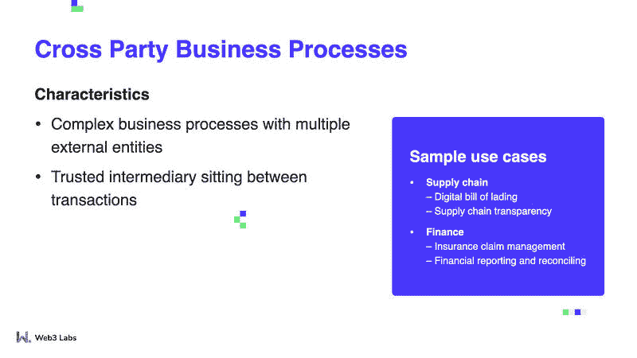
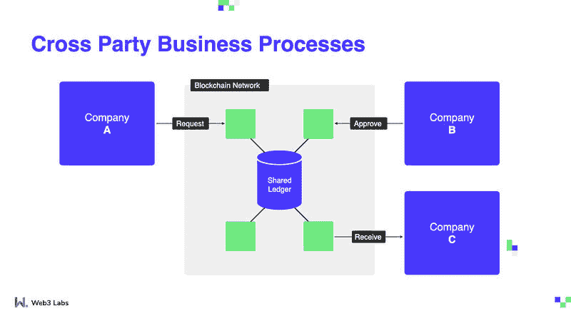
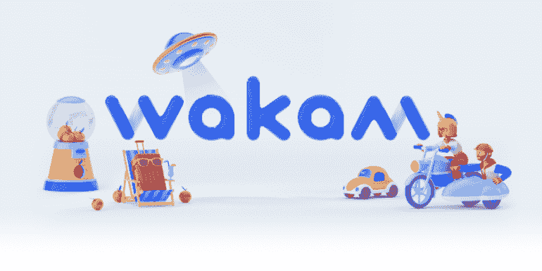

# 区块链如何简化复杂的业务流程

> 原文：<https://blog.web3labs.com/how-blockchain-simplifies-complex-business-processes>

区块链最擅长的事情之一就是简化复杂的业务流程。考虑到使用这项新生技术的障碍，这听起来可能有点违背直觉，但是继续读下去，你就会明白为什么了。

许多大公司在日常运营中与众多供应商和其他企业打交道。如果他们有足够的规模，他们甚至可以与同一个公司的多个其他实体打交道。这些支持其核心业务的交易创建了一个连接网络，需要在这些不同的实体或供应商之间进行大量的来回通信。通过使用类似区块链的同样可访问、安全、透明和防篡改的技术，复杂或跨党派的过程可以变得更加容易和快速。

一个常见但复杂的业务流程是通过销售转移所有权:默认情况下，这需要一个中介作为买卖双方之间的可信中介，处理资产所有权的实际转移和支付货物的资金处理。由于中间人位于交易中间，转让变得更加复杂，因为被转让资产的卖方和买方都需要根据与中间人的互动，在销售和后续转让的每个阶段更新自己的内部系统。这看起来似乎是做生意的逻辑方式，但区块链通过为各方提供单一、不变的真相来源，消除了这一额外的复杂和潜在成本高昂的过程的需要。这可以大大简化这些流程，从长远来看，可以为企业节省大量资金。

举一个简单的例子——就像买了一栋房子，不再需要律师来处理资金转移和产权契约！

## **更好的方法**

****

在区块链上使用共享分类账可以减少甚至消除对中介机构的依赖，因为中介机构往往既费钱又费时。然而，共享分类账引入了一大堆其他问题，主要围绕安全性和透明度。区块链是防篡改的，这意味着改变任何记录的数据都会破坏整个链并使其无法使用——但即使达到这一点也意味着逆转以最高安全性为目的的复杂加密过程。区块链也是完全透明的(在一个私人的、许可的网络中，这仅包括参与者)，因此它可以被视为每个参与者的中立竞技场。

供应链行业是区块链实施取得巨大成功的一个特定领域。当将货物从一个地方运送到另一个地方时，许多不同的公司至少会对旅程的几个阶段感兴趣。从产品的装载到到达，过程的每个部分都可以记录在区块链上，而不是必须在几个参与者之间进行协调并相互交换信息。

一个这样的例子是 Komgo:一个总部设在区块链的商品贸易网络。基于区块链的分类账允许 Komgo 利益相关者将货物运输的验证数字附加到特定的信用证上，当银行临时拥有商品运输时，这降低了欺诈的可能性。自公开推出以来的一年中，Komgo 支持了网络成员提供的近 10 亿美元的融资。

保险是区块链可以帮助简化现有流程的另一个领域。有几个参与者，从保险公司到承保人，再到保险购买者，每个人都需要访问相同的信息。每个人都有一个真实的来源，通过简化数据协调和提高准确性，减少了环境中的摩擦。此外，从长远来看，所有这些都会显著降低成本。埃森哲技术愿景 2019 调查显示，80%的受访保险公司声称他们已经采用或计划采用区块链技术。

Anthem 是美国第二大医疗保险公司。2019 年 12 月，[他们宣布了一个试点区块链项目](https://www.forbes.com/sites/leahrosenbaum/2019/12/12/anthem-says-its-40-million-members-will-be-using-blockchain-to-secure-patient-data-in-three-years/?sh=7c16c6ca6837)，该项目将保护他们 4000 万会员的医疗数据。用户将能够通过应用程序扫描二维码，并在有限的时间内授权医疗保健提供商访问他们的记录，以保持这些记录的隐私，但也可以在预约结束后立即撤销该权限，并保护他们的数据。Anthem 补充说，他们计划以大约 12 种方式使用区块链，其中大约 40%已经上线。

[Wakam](https://www.wakam.com/) 是一家保险公司，原名 La Parisienne，历史悠久，成立于 1829 年，为法国的第一辆马车提供保险。现在，他们使用区块链来扭转通常的模式:代替客户必须提供损害证明，现在保险公司做这件事，同时自动化索赔过程。

去除中介，以及昂贵和耗时的过程，已经证明了它在游戏产业中的作用——或者至少是其中的一部分:Xbox 游戏发行商，以前要等 45 天才能拿到版税，现在只需几分钟就能拿到钱。现在引入区块链意味着会计不必依赖于因使用不同的账簿和离线分类账而导致的对账。出版商也看到了其他好处:现在他们几乎可以即时获得客户人口统计数据，从而可以根据需要定制他们的活动。

## **潜在反驳**

在每一次关于区块链及其优势的对话中，都会出现一些常见的争论，需要加以解决:

*   **区块链太复杂和/或入门太难。**虽然区块链确实很复杂，但选择正确的团队、技术和用例可以降低这种复杂性，甚至完全消除这种复杂性。就像当你雇佣一个团队为你的企业创建一个应用程序时，你不必考虑编程应用程序的技术细节一样，你不会在表面上看到区块链的复杂性，因为它将在那里被使用。
    
*   和解是生活的现实。严格来说，现在确实如此，但这绝对不是事情应该保持现状的理由。改善和简化业务流程，即使是那些看似不可改变和不可避免的流程，从长远来看，既能让你免去许多头痛，又能提高你的生活质量。有了正确的心态，升级也是生活的一部分。

### **有兴趣了解更多信息吗？**

我们提到的用例只是区块链已经留下印记的地方的一些例子。还有无数其他领域具有长期增长的巨大潜力。如果您有兴趣了解更多关于区块链如何帮助您的信息，您可以报名参加我们即将举办的[成功区块链部署原则网络研讨会](https://pages.web3labs.com/principles-of-successful-blockchain-deployments-webinar)。在这里，您将了解每个用例的更多信息，以及如何确保您成功使用该技术。你同意我们在这里提出的论点吗？请随时告诉我们！