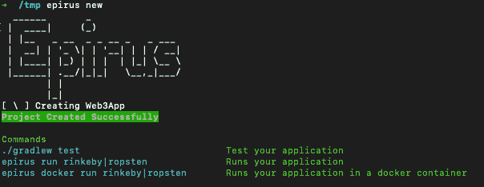
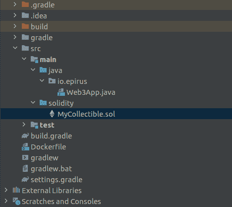
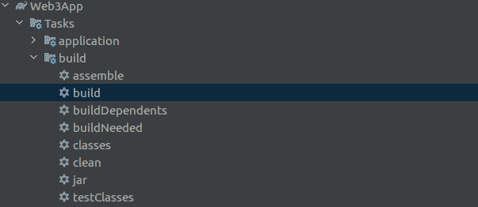
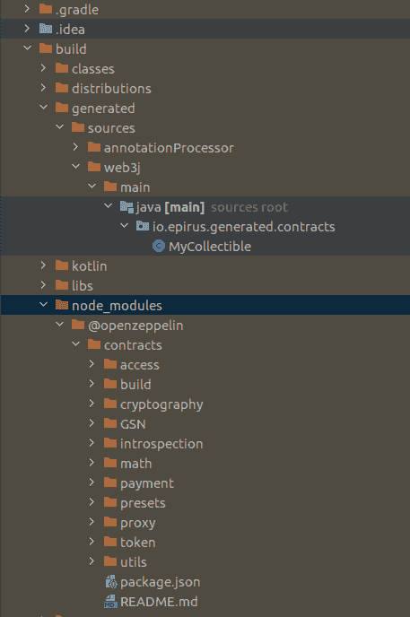

# Web3j 中的可靠性依赖管理

> 原文：<https://blog.web3labs.com/web3development/solidity-dependency-management-comes-to-web3j>

在 Web3 实验室，我们的核心任务之一是让以太坊开发更容易为 Java 和 Android 社区所用。为此，我们刚刚为 Web3j 添加了一个非常棒的新功能——它现在可以自动为您解析第三方合同依赖关系。没错——不再需要将 OpenZepplin 和其他项目中的代码复制和粘贴到您的 Java 项目环境中——Web3j 会为您做到这一点！

继在 Java 项目中编译 Solidity smart contracts 的 Solidity Gradle 插件取得成功之后，今年早些时候，我们添加了 [Sokt](http://docs.web3j.io/web3j_sokt/) ，它消除了在您的系统上安装 Solidity 编译器的要求。Sokt 不仅会在您的系统上安装 Solidity 并管理安装，还会根据 pragma 版本为您的合同下载正确的版本。

我们现在可以导入任何发布为 NPM 包的 Solidity 库。

因此，有了这个新特性，您将能够编译一个 Solidity 智能合同，导入第三方库，而不需要手动下载它们。例如，您不需要下载 [OpenZeppelin](https://github.com/OpenZeppelin/openzeppelin-contracts) 库并进行正确的映射来编译以下代码:

```java
pragma solidity ^0.6.0;

import "@openzeppelin/contracts/token/ERC20/ERC20.sol";

contract ERC20Token is ERC20 {
      constructor() ERC20("My Token", "MT") public {
      }
}
```

然后，使用 Web3j 插件可以生成智能合同绑定，以便与来自 Java 的合同一起工作！

你可能会问的一个明显的问题是，为什么我们不仅仅使用 Java 的 Maven 依赖管理。目前，大多数发布智能合同的团队都在使用 NPM，最突出的例子是 OpenZeppelin。将所有这些工件作为单独的 Java 工件发布到 Maven 仓库是不可行的，因此合理的解决方案是直接从 NPM 下载它们，为开发人员提供更大的控制。

## 快速启动

要在您的项目中应用插件，只需确保您的 build.gradle 文件中有以下代码行:

```java
plugins {
    id "org.web3j.solidity" version "0.3.0"
}
```

然后，您可以使用下面的' @ '语法合并来自另一个项目的代码。

```java
import "@openzeppelin/contracts/token/ERC20/ERC20.sol";
```

如果你是从零开始，你可以遵循下面的例子。

## **入门**

*   使用 epirus new 或 epirus import 创建一个新项目。



*   在主/实体目录下创建一个新的智能合同。

> ^0.6.0 实用主义；
> 
> 导入“@ open zeppelin/contracts/token/er C20/er C20 . sol”；
> 
> 我可收集的合同是 ERC20 {
> constructor() ERC20("我的令牌"，" MT") public {
> }



*   运行 gradle 构建任务。



仅此而已，插件会搞定一切。在构建目录下，您应该拥有所有需要的依赖项。



更好的是，您可以尝试使用 [OpenAPI](https://github.com/web3j/web3j-openapi-gradle-plugin) 插件，它将生成一个 OpenAPI 兼容的服务，而无需自己编写任何 Java 代码。

我们很想听听你对这个新功能的看法——这是我们在 Web3j 中多年来一直想要的东西，我们真的很高兴能让它可用。我们希望它能进一步加速你对 Web3j 的开发！