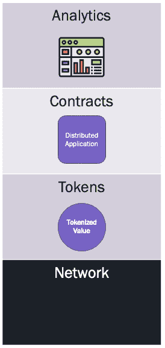

# IW 什么？介绍互通联盟

> 原文：<https://blog.web3labs.com/the-iw-what-introducing-the-interwork-alliance-the-missing-piece-for-tokens-in-enterprise>

今天标志着[互通联盟](https://interwork.org/) (IWA)的启动，这是一个行业组织，旨在推动令牌化资产的标准化。它的发起成员包括[埃森哲](https://www.accenture.com/gb-en)、[瑞士瑞信银行](https://www.credit-suisse.com/global/en.html)、 [DTCC](https://www.dtcc.com/) 、 [IBM](https://www.ibm.com/uk-en) 、 [ING](https://www.ing.com/Home.htm) 、[微软](https://www.microsoft.com/en-gb)、[纳斯达克](https://www.nasdaq.com/)、[瑞银](https://www.ubs.com/uk/en.html)，当然还有 Web3 实验室，这证明了这项倡议的重要性。

## 

## 企业令牌标准

随着过去几年 DLT 上资产证券化的大幅增长，组织面临的主要挑战之一是如何最好地采用这些技术。

有多个平台和生态系统可供选择。其中一些提供了他们自己的标准计划(如以太坊的[企业以太坊联盟](https://entethalliance.org/)，其他的提供了一个标准化的平台，用于在不同的平台上开发，如[数字资产](https://digitalasset.com/)的 DAML 平台。

然而，对于这些平台，它们通常是以自下而上的方式出现的。技术已经建立，在某些情况下，业务应用程序是围绕技术定义的，而不是从他们试图解决的业务问题的角度定义的。

互通联盟就是为了应对这一挑战而成立的。它旨在弥合企业与分布式账本和多方计算等技术提供的机会之间目前存在的差距。

在允许标准由它们所解决的业务问题而不是底层技术来定义的情况下，IWA 将确保采用这些技术的方式最适合它们所解决的底层业务需求，从而清楚地表明这些技术应该如何协调工作。

## 规范堆栈

IWA 采取的这种市场驱动的方法反映在它打算制定的规范堆栈中。每一层都将支持与底层业务目标相关的不同抽象。这些分为令牌、合同和分析，它们将是技术中立的，如下面的堆栈所示。

*   令牌层使用[令牌分类框架](https://blog.web3labs.com/tokens-for-enterprise)来描述令牌化资产所需的底层行为。
*   合同层使用交互框架抽象来定义跨多个分类帐平台的智能合同的通用语言和通信协议。
*   分析层提供了在服务之间以保护隐私的方式共享数据的模式，并支持市场驱动的报告。

## 工作组和指南

堆栈的每一层都将由自己的工作组支持，该工作组负责为该层创建标准。他们将由业务工作组补充，专注于支持特定用例或垂直行业的要求，确保堆栈规格符合目的。最后，集团的指导委员会将监督整个集团。

## 展望未来

IWA 的首要目标将是在其产生的标准之上提供认证。然而，从近期来看，提供技术不可知的标准将是企业令牌的重要驱动力，因为将有大量的底层平台和实现可供选择。

以太坊无疑是代币经济和 DeFi 的主要创新者和推动者。通过提供一个不仅支持以太坊还支持其他平台的通用标准，我们将更有信心让企业大规模运行这些技术。

由于 IWA 刚刚推出，接下来的几个月将是一个迷人的时刻，我鼓励你前往[互通联盟](http://interwork.org/)了解更多！