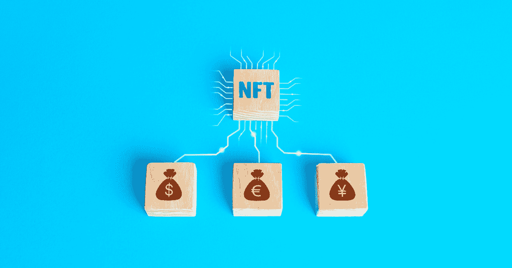

# 追求（尤指追逐性伴侣）的快感

> 原文：<https://blog.web3labs.com/the-thrill-of-the-chase>

## 为什么有些东西最好离开链

感知稀缺是价值的一大驱动力。在过去的 12 个月里，这一点在 NFTs 领域表现得最为明显。收藏家、投资者和投机者都涌向 NFT，试图获得独家发行，希望这些 NFT 的价值在未来几天、几个月或几年内大幅升值。

许多人都渴望他们的投资会像 Cryptopunks、Bored Ape Yacht Club (BAYC)或 Beeple 的一些高调作品一样。但可能的现实是，这其中的大部分将归零，因为我们都知道，当人群开始根据早期少数人的回报涌入这些投资时，是时候寻找退出了。

即使你是少数几个幸运地看到 NFT 回报丰厚的人之一，当你在赚钱的时候，能够采取行动抓住上涨机会的可能性仍然很小。关键是，我们都知道 NFT 市场目前存在令人难以置信的泡沫，它们可能会在某个时候企稳，但当它们企稳时，大多数艺术品或收藏品的未来会不会是连锁的非功能性艺术品？

我认为不会。

虽然我确实相信，非传统艺术作为一种资产类别将会继续存在，并将在它们所涉及的行业中传播得更广(有关这一点的更多信息，请参见我的上一篇[帖子](/web3-is-tokenisation-of-everything))，但在艺术和收藏品的背景下，我认为它们是对这些现有实物市场的补充，而不是继承者。原因是*追逐的快感*。

存储在区块链上的资产的透明度和可追溯性被认为是这种技术的显著优点。在数字资产供应的背景下，将管理其供应的规则纳入协议为其用户提供了无与伦比的可见性，这是比特币和其他加密货币如此受欢迎的主要原因——这是因为它们不能像法定货币的货币政策那样被篡改。

这种方法并不是万无一失的，因为存在覆盖机制，冻结 USDT 账户就是一个这样的例子(一旦冻结，这些资金会发生什么本身就是一个有趣的问题)，这种链上活动可见性的想法是区块链协议的用户所习惯的。

这当然扩展到存储在链上的单个独特的资产，例如 NFTs。但是，当涉及到故意稀缺或可收藏的项目时，每个人都希望所有这些都存在于链上吗？在分散的账本上提供资产的所有权和出处是有好处的，但这是我们都想要的吗？我是否总是想知道仅仅通过引用一个区块链就创造了多少个稀有物品的复制品，以及所有者是谁？

虽然这在表面上看起来很合理，但我相信深入到人类的心灵深处，这并不是每个人的愿望。生活中有许多领域充满了追逐的刺激——对某样东西的期待超过了回报本身，这是如此令人兴奋。在我看来，这是一个所有东西都在链上的领域，抑制了寻找或保护你一直在寻找的难以捉摸的东西的潜在多巴胺冲击。

例如，让我们考虑可收集的卡牌游戏“魔法:聚会”，其中玩家通过施法、使用人工制品和使用卡片召唤生物来与其他玩家战斗，这些卡片具有不同的稀缺属性(常见、不常见、罕见和神秘罕见)。玩家和收藏家之间的交易非常活跃。以至于游戏中最贵的卡片[去年卖到了 511，100 美元](https://www.hipstersofthecoast.com/2021/01/psa-10-graded-signed-alpha-black-lotus-sells-for-511100/)。虽然这种卡片被广泛认为是稀缺的，但没有人知道到底有多少张这种签名卡片存在，毫无疑问，有收藏家试图找到更多这种难以捉摸的卡片。

另一个例子是金属探测器，他发现了一枚 13 世纪的金币，几周前卖到了 648，000 美元。在它被发现之前，没有办法知道这枚硬币的存在。记录挖掘者、集邮家和古文物学家都是这方面突出的例子。

想象一下，如果在未来的项目是由一个 NFT 代替，甚至可能是数字签名。由于它位于区块链，作为一名感兴趣的收藏家，你可以在瞬间确定它们的数量，并看看是否有任何所有者愿意出售它们。这大大降低了稀缺溢价，因为你所知道的所有信息都存在于供应链上。虽然在某些情况下，管理这些资产的钥匙丢失了，但没有机会在庭院销售中或在积了几十年灰尘的阁楼上找到模糊的 NFT。这种物理挖掘是收藏家的一大驱动力。

为了从其他一些更少的小众角度来欣赏这一点，想象一下，如果在约会或寻找伴侣时，你的指尖上有所有关于潜在匹配的信息。根据你居住的地区，你可以准确地看到有多少单身人士和你合得来。

虽然这种专横、控制的社会通常是科幻小说的背景，但问题是，如果所有稀缺的东西都生活在链条上，你就失去了发现它的兴奋，这就是为什么我不相信 NFT 市场会取代许多现有的收藏品市场。

人们很容易沉迷于与追逐刺激相关的多巴胺热潮，这在智能手机上表现得最为明显。在这种情况下，通知到底是什么？是你的电话打断了你，告诉你有事发生了。

这里的东西几乎可以是任何东西，这取决于你对通知的严格程度，以及在什么时候你最兴奋？当你听到叮的一声，感受那种嗡嗡声。你不知道它是什么，但你想知道，正是这种不确定性让你内心激动，释放多巴胺，然后你看着你的手机，你看到有人给你发了一封电子邮件，要求你写一份报告，你的配偶让你跑腿，或者可能是你孩子的学校告诉你，你的孩子生病了，需要回家。

不管是什么，这种所谓的奖励很少是这样的。然而，有那么几秒钟，你会感受到内心的激动，它会照亮你，这是人们将继续参与的原始激动。这就是为什么，虽然 NFT 有一个非常光明的未来，但我不认为人们希望一切都是连锁的，因为追逐越艰难，刺激越大。

有任何问题或意见吗？我们希望收到您的来信！如果你想了解更多关于区块链、它的成长和最新发展的信息，那就去看看我们的[博客](https://blog.web3labs.com/)或者听听我们启发性的[区块链创新者播客](https://podcast.web3labs.com/)。