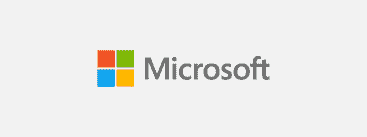
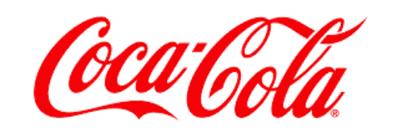
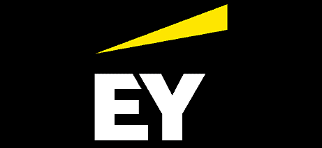

# 区块链的下一步是什么？可信的记录系统

> 原文：<https://blog.web3labs.com/whats-next-for-blockchain-trusted-systems-of-record>

各种形式和规模的企业，尤其是供应链和采购行业的企业，在内部记录系统和解决方案上浪费了数亿美元，而这些系统和解决方案只能大致满足他们在资源规划和采购、客户管理等方面的所有需求。

最大的问题围绕着将正确的数据进一步传递到一上一下的价值链关系之外。结果，企业被迫使用拼凑起来的孤立系统，在这些系统中，没有人能够信任数据，从而限制了整个供应基地的可见性、敏捷性和协调性。

更重要的是，未能在企业间充分协调这些系统会引发多米诺骨牌效应。这将导致严重的中断、库存损失、纠纷、资本成本膨胀、监管罚款和其他资源浪费。

为了解决这些问题，或者完全避免这些问题，企业需要一个共同的参照系。这个参考框架必须持续运行，高度防篡改，并能够防止任何人接管系统，将组织锁定在运营之外。

然而，集成这样的解决方案需要资本支出，这不是很多公司能够负担得起的。通过使用公共区块链或锚定到其上的第 2 层网络，可以得到满足上述所有要求的经济实惠的解决方案。

### **将区块链纳入麾下**

在这一过程中部署区块链使企业生态系统中的所有授权方拥有一个可信的记录系统，允许他们共享各种数字数据。在这样的系统中，每一方都同意交易，这保证了网络验证的共识，并提供了各方交易的完全可见性。同时保证了安全性和真实性。这也是解决组织之间传统的缺乏信任(例如，数据可能会找到它的竞争对手)的解决方案，允许安全地共享数据，同时消除破坏竞争优势的风险。

### **基线协议解决方案**

一个让这个原则成为现实的项目是[基线协议](https://www.baseline-protocol.org/)。它始于 2020 年，是一个倡议和 [OASIS](https://oasis-open-projects.org/) 开源项目，结合了区块链、零知识加密和消息传递的进步。主要目标？以低成本创建安全和私有的业务流程。

借助这项新技术，基线协议旨在满足企业 IT 部门对安全性、隐私和性能的高标准要求，而以前的区块链技术无法轻松满足这些要求。

基线协议是区块链初创公司 [Provide](https://www.youtube.com/watch?v=0556CIfzn8A) 和 [Unibright](https://unibright.io/) 的产物，它们共同满足了组织参与支持基线的业务流程的主要需求。除了得到 14 家创始公司的支持之外，Baseline 协议后来也被更多的公司加入，这种趋势一直持续到今天。

从包含一组“普通”包的 [v1.0 核心](https://docs.baseline-protocol.org/baseline-protocol-code/packages)开始，使用基线协议构建解决方案是可能的。然而，企业也将能够在现有参考实现的基础上进行构建，如 [BRI-1](https://docs.baseline-protocol.org/bri/bri-1) 或 [BRI-2](https://docs.baseline-protocol.org/bri/bri-2) 。

### **微软的云供应链**

****

微软已经开发了自己的[解决方案](https://www.microsoft.com/en-us/industry/manufacturing/microsoft-cloud-for-manufacturing)，该方案于 2018 年初首次构思，并于 2020 年末与八家供应商一起投入生产。从那时起，它一直在逐步增加其商品价值链中的库存和交易量。该公司的融合 ERP 和区块链解决方案基于 ERP 作为财务记录系统和区块链作为用于交易、监控、遥测和归档的可扩展 n 层记录系统的原则。

它包括一个区块链财团，报告支持物流服务提供商作为一个代理，财务对账，ERP，供应链服务集成，规划，以及主数据，CRM 和数据仓库。使用区块链作为基础构建模块，该公司旨在促进一系列的优势。其中包括标记化库存、序列化跟踪和追溯、来源和保管保证、标记化发票和采购订单、金融化资产的数字化交易以及可持续性数据捕获。

### 可口可乐装瓶公司 **y**

****

为了确保其供应链的透明度，最大的可口可乐装瓶企业[Coke One North America Services(CONA)](https://www.conaservices.com/)所属的 IT 提供商已同意对基线协议进行试运行。nCONA 已经在使用与 SAP 共同设计的 Hyperledger Fabric 解决方案，该解决方案允许装瓶公司交换信息(在这方面，Hyperledger 还开发了 Grid，这是其利用分布式分类帐组件构建供应链解决方案的新平台)。然而，使用现有的解决方案，数据仅在 CONA 装瓶厂和特许经营商之间共享，这就是该公司转向基线协议的原因。基于以太坊的基线协议将允许它将外部供应商纳入过程，如罐和瓶的制造商。这只能通过公共区块链来完成。

这样，如果供应商库存不足，买方就不会对交付的数量错误感到惊讶。当供应商进行更改时，更改会显示在区块链上。该解决方案不存储订单本身的细节，而是零知识证明，还保护任何智能合同。

### **EY 咨询公司**

****

咨询公司 [EY](https://www.ey.com/en_gl) 也在其 EY OpsChain 网络采购解决方案中实施了基线协议。实施这一基于区块链的解决方案的目的是将复杂的供应商协议转化为智能合同，赋予他们可追溯性和合同管理能力。

这将使买卖双方成为一个网络，每个人都可以了解交易量和支出，以及最新的利率和条款。该公司正试图利用它来解决公司网络、合作伙伴和供应商之间竞争日益激烈的问题。

它认为引入网络工作能力是一个有效的解决方案，高于任何单一企业资源规划系统的水平。由于整个过程是在公共链上进行的，所以没有必要说服企业或供应商加入一个昂贵的、封闭的专有网络。

### **遗言**

部署可信的记录系统有助于解决供应链中的一系列问题。这些问题包括现有解决方案的高昂价格、有限的协调能力，以及缺乏信任、安全性和可见性。但除了这些明显的问题，它还可以走得更远。

换句话说，它还可以解决人道主义问题，如在高科技和以技术为重点的行业(如汽车)中使用冲突材料，因为它实现了从开采原材料到回收和/或处置的全程可追溯性。这就是为什么开发可信记录系统的解决方案不仅是改善供应链的必要条件，也是建设更美好世界的必要条件。

你认为记录系统的未来会怎样？有任何问题或意见，或者您是否注意到我们遗漏了什么？我们希望收到您的来信，请给我们留言！我们还邀请您查看我们的[博客](https://blog.web3labs.com/)或加入我们的资讯性和娱乐性[区块链创新者播客](https://podcast.web3labs.com/)。在那里，你可以更多地了解区块链的革命世界及其不断的创新。